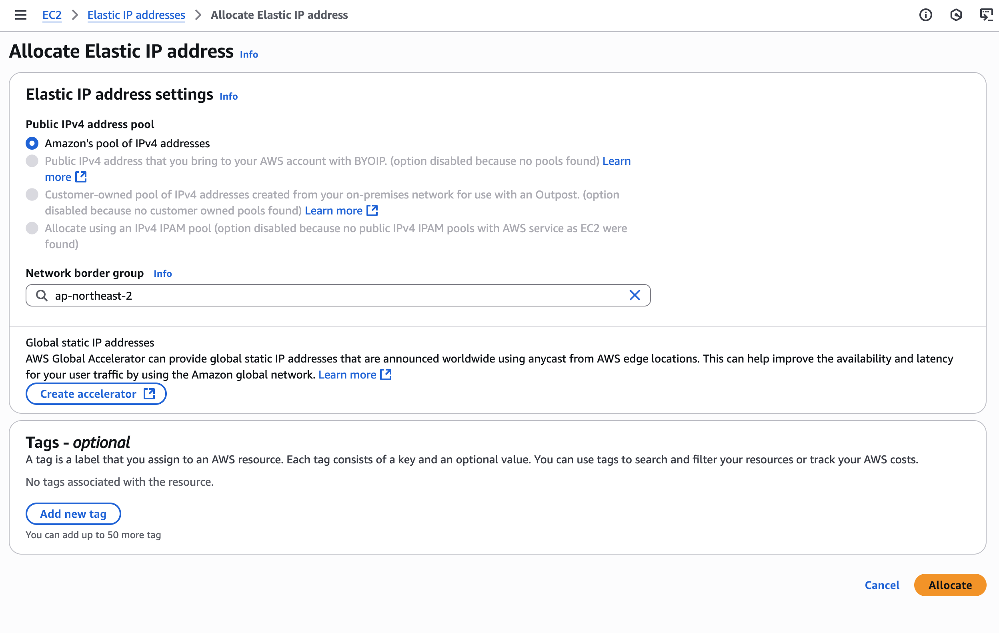
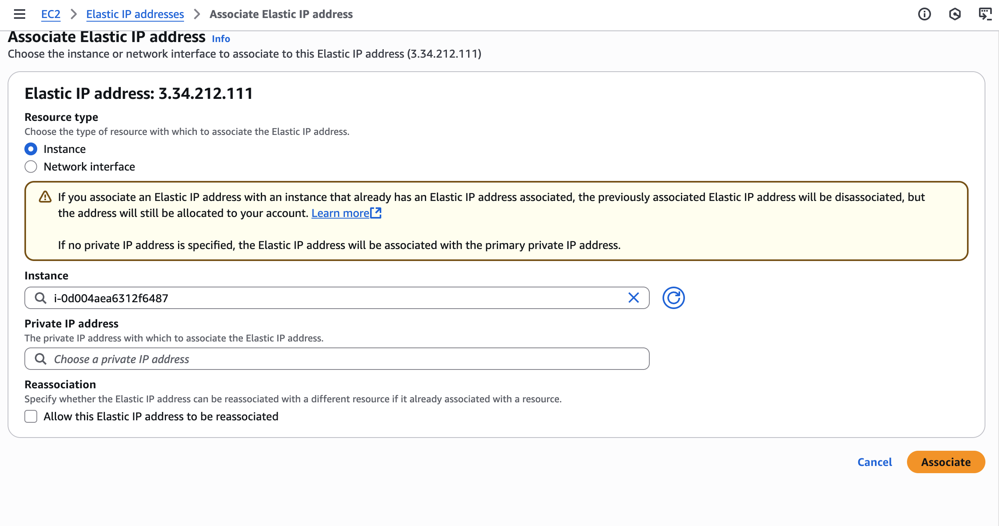
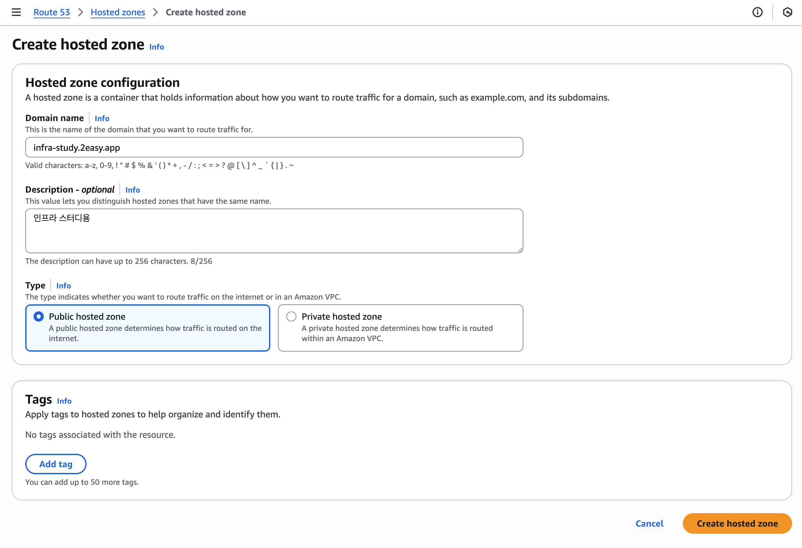
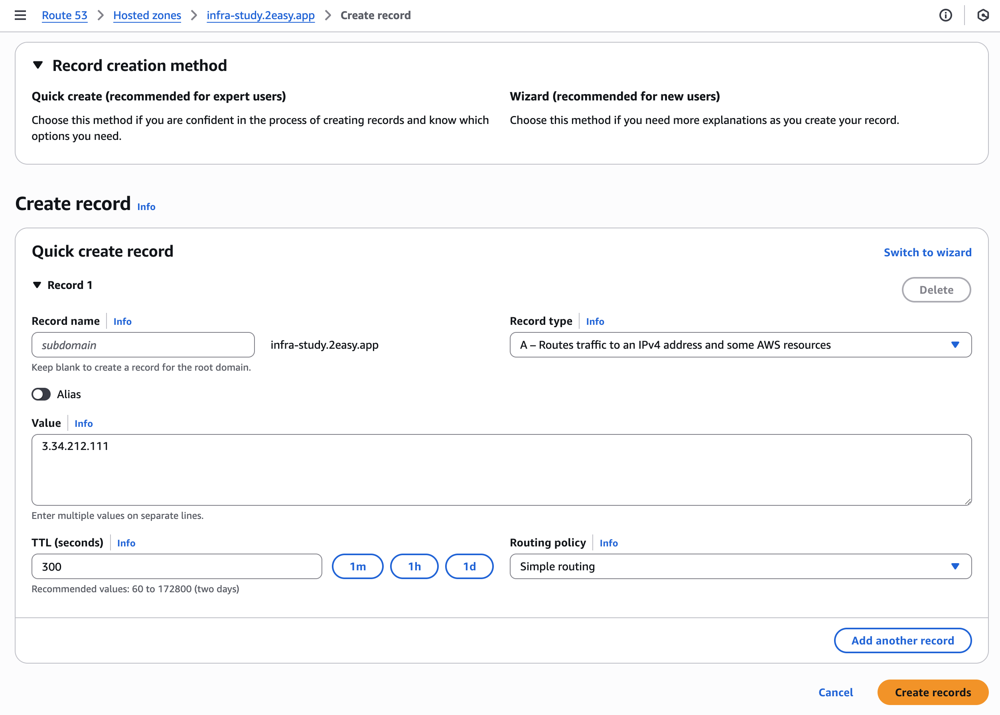
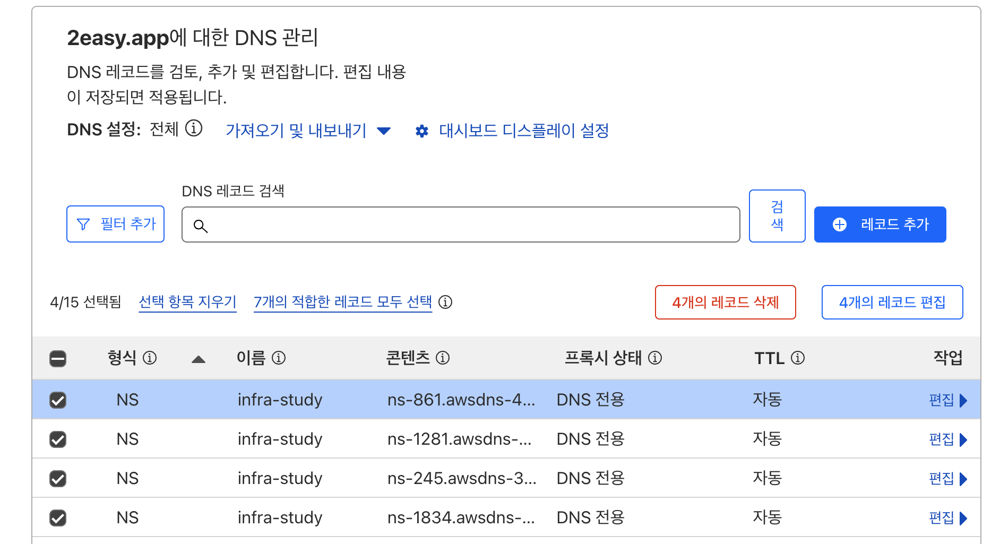
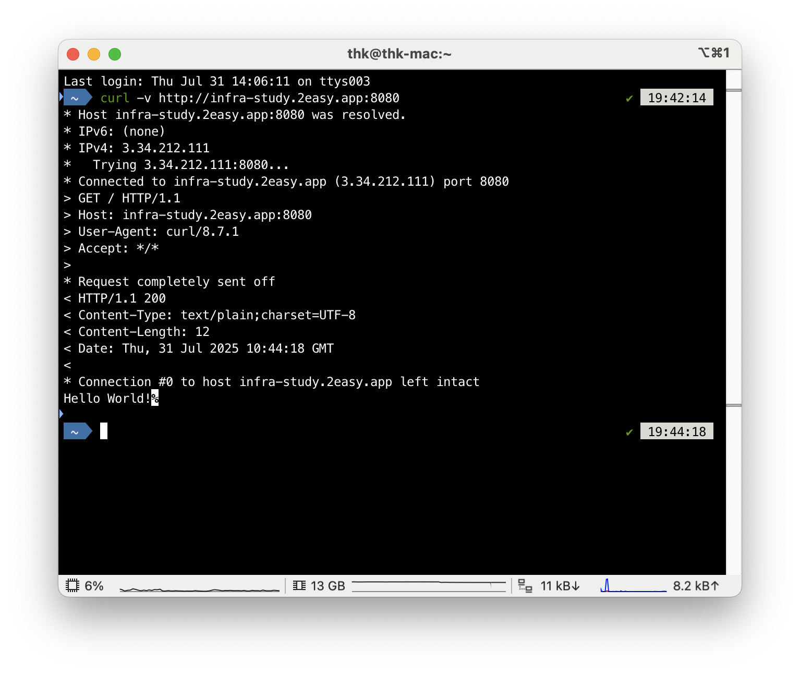
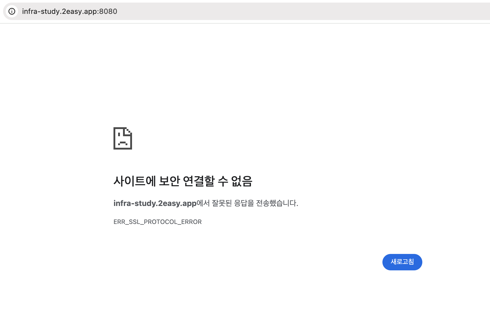
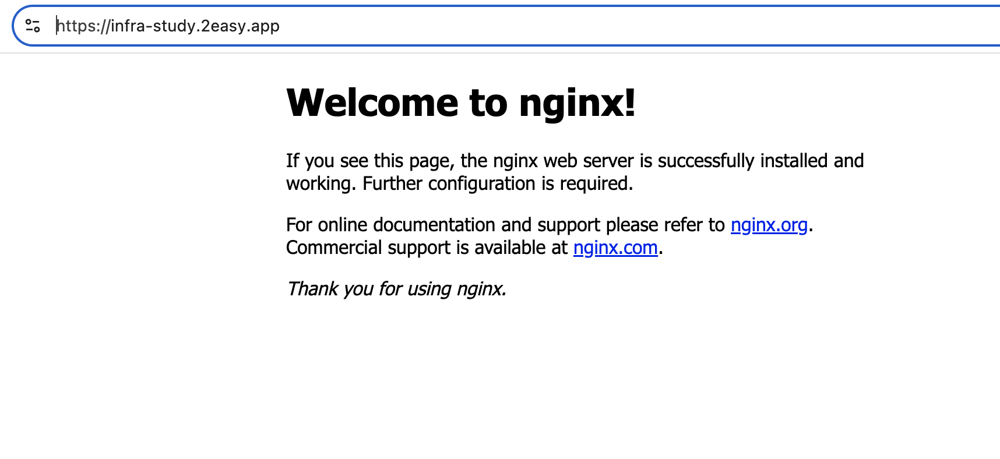

## 과제 요약

### 1. 서버 준비 및 고정 IP 할당

- EC2 인스턴스 준비.
- **탄력적 IP(Elastic IP)**를 생성하여 EC2 인스턴스에 연결, 변경되지 않는 고정 공인 IP 주소를 확보함.

### 2. 도메인 연결 (DNS 설정)

- **Route 53**에서 infra-study.2easy.app에 대한 **호스팅 영역(Hosted Zone)**을 생성함.
  
- 생성된 호스팅 영역 내에서 infra-study.2easy.app 도메인을 1번에서 만든 탄력적 IP 주소로 연결하는 **A 레코드**를 생성함.
  
- 상위 도메인(2easy.app)을 관리하는 **Cloudflare**의 DNS 설정으로 이동함.
- infra-study 서브도메인에 대한 **NS 레코드** 4개를 추가하여, 해당 서브도메인의 DNS 제어 권한을 AWS Route 53으로 위임함.
  
  
  

### 3. 웹 서버(Nginx) 설치 및 방화벽 설정

- EC2 인스턴스에 SSH로 접속하여 **Nginx** 웹 서버를 설치하고 실행함.
- AWS **보안 그룹**의 인바운드 규칙에 **HTTP(80)**와 **HTTPS(443)** 트래픽을 허용하는 규칙을 추가함.

### 4. HTTPS 통신 활성화 (SSL 인증서 적용)

- 무료 SSL 인증서를 자동으로 발급 및 설치해주는 **Certbot**을 설치함.
- Nginx 설정 파일(/etc/nginx/nginx.conf)에 server_name infra-study.2easy.app;을 명시하여 Certbot이 대상을 찾을 수 있도록 수정함.
- Certbot을 실행하여 **Let's Encrypt**로부터 SSL 인증서를 발급받고 Nginx에 자동으로 적용함.
