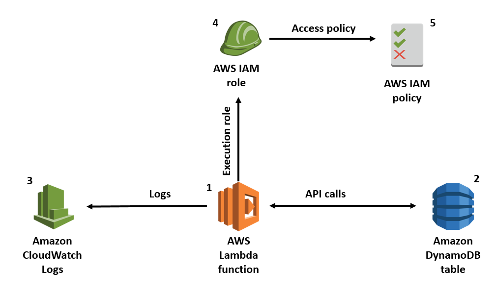

### 주요 개념 정리

### IAM 역할 (Role)

*   EC2 인스턴스나 AWS 서비스에게 부여하는 **임시 권한 증명서**.
*   코드에 액세스 키(Access Key)를 직접 하드코딩하는 위험한 방식 대신 사용.
*   우리가 만든 `infra-study-role`을 EC2에 연결했기 때문에, EC2는 별도의 키 설정 없이 S3에 접근할 권한을 자동으로 얻음. 보안과 관리에 필수적.

### 보안 그룹 (Security Group)
*   EC2 인스턴스에 적용되는 **가상 방화벽**. 인스턴스로 들어오고 나가는 트래픽을 제어.
*   기본적으로 모든 인바운드(Inbound) 트래픽은 차단. 필요한 포트만 명시적으로 허용해야 함.
*   **우리의 설정:**
    *   **RDS 보안그룹:** `EC2의 보안그룹`으로부터 오는 `3306` 포트(MySQL) 트래픽만 허용.
    *   **EC2 보안그룹:** `모든 IP(0.0.0.0/0)` 로부터 오는 `22` 포트(SSH) 트래픽을 허용하여 GitHub Actions가 배포할 수 있도록 함.

### S3 객체 스토리지 (Bucket, Key, Object)
*   S3는 PC의 파일 시스템(계층적 폴더 구조)과 다름. 사실상 **Key-Value 저장소**임.
*   **버킷(Bucket):** 파일을 담는 최상위 컨테이너. 버킷 이름은 전 세계에서 유일해야 함.
*   **객체(Object):** S3에 저장되는 데이터의 기본 단위. 즉, 파일 데이터 그 자체와 파일의 메타데이터(정보)를 포함.
*   **키(Key):** **버킷 내에서 객체를 식별하는 고유한 이름(주소)**. 우리가 흔히 생각하는 '파일 경로 + 파일명'에 해당.
    *   예시: `images/profiles/user-avatar.jpg` 전체가 하나의 '키'가 됨.
    *   결론: "버킷 이름이 키"가 되는 것이 아니라, **"키는 버킷 안에서 파일의 고유한 주소 역할을 하는 문자열"**임.

### 설정 정보 외부화 (환경변수)
*   DB 비밀번호 같은 민감 정보를 소스 코드(`application.yml`)에서 분리하는 전략.
*   **로컬 환경:** `.env` 파일에 로컬 DB 정보를 기록. 이 파일은 `.gitignore`에 추가하여 절대 Git에 올리지 않음.
*   **배포 환경:** `GitHub Secrets`에 실제 운영 DB 정보를 저장. CI/CD 파이프라인(`deploy.yml`)이 이 값을 가져와 `docker run -e` 명령어로 컨테이너 내부에 환경변수로 주입.
*   덕분에 동일한 코드(Docker 이미지)가 어떤 환경에서 실행되느냐에 따라 다른 설정을 바라보게 됨.
