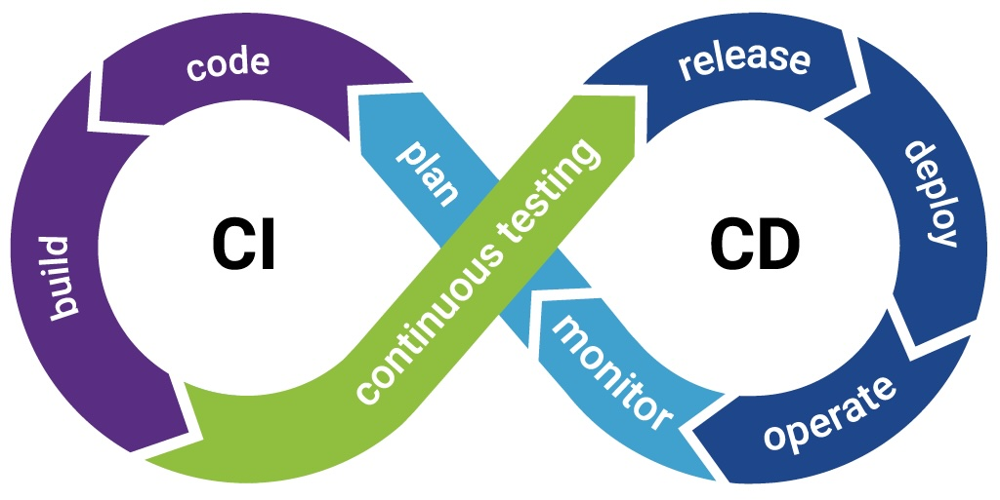

## 개념 정리

### 1. GitHub Actions 워크플로우 분석

### 1.1 환경변수 관리 전략

워크플로우에서 변수를 관리하는 방식은 크게 `secrets`와 `env` 두 가지로 나뉨.

- **`secrets`: 민감 정보용 암호화 저장소**
    - **목적:** DB 암호, 클라우드 액세스 키, SSH 개인 키 등 절대 외부에 노출되면 안 되는 민감 정보를 저장하기 위함.
    - **특징:**
        - GitHub 레포지토리의 `Settings > Secrets and variables`에 암호화되어 저장됨.
        - 가장 중요한 특징은 **마스킹(Masking)** 기능으로, 워크플로우 로그에 값이 실수로 출력되더라도 자동으로 `**` 처리하여 유출을 방지함.
    - **사용법:** 항상 `secrets` 컨텍스트를 통해 접근해야 함.
        
        ```yaml
        # secrets에서 직접 값을 가져와 사용
        with:
          aws-access-key-id: ${{ secrets.AWS_ACCESS_KEY_ID }}
          host: ${{ secrets.EC2_HOST }}
        ```
        
- **`env`: 비민감 정보용 일반 변수**
    - **목적:** 워크플로우 전반에서 사용될 비민감 정보나, `secrets`의 값을 받아와 편리하게 사용하기 위한 변수를 정의.
    - **특징:** 로그에 값이 그대로 노출됨. 민감 정보를 직접 넣어서는 절대 안 됨.
    - **유효 범위(Scope):** `env`는 정의된 위치에 따라 유효 범위가 달라짐.
        1. **워크플로우(Workflow) 수준 `env`:**
            
            ```yaml
            # 파일 최상단에 정의
            env:
              AWS_REGION: ${{ secrets.AWS_REGION }} # secrets의 값을 받아와 env 변수로 사용
              ECR_REPOSITORY: spring-cicd-practice   # 비민감 정보
            
            ```
            
            - **범위:** 워크플로우 내의 **모든 Job에서** `env` 컨텍스트를 통해 접근 가능함 (`env.AWS_REGION`).
        2. **Step 수준 `env`:**
            
            ```yaml
            - name: Build, tag, and push image to Amazon ECR
              env: # 이 env는 아래 run 블록 내에서만 유효함
                IMAGE_TAG: ${{ github.sha }}
              run: |
                docker build -t ...:$IMAGE_TAG .
            
            ```
            
            - **범위:** 해당 Step 내에서만 유효함. 변수의 영향 범위를 최소화할 때 유용.
- **관리 방법**
    1. **보안:** 조금이라도 민감하거나, 환경에 따라 바뀔 수 있는 값이라면 무조건 `secrets`에 등록.
    2. **범위 최소화:** 변수는 필요한 가장 좁은 범위에 정의하는 것이 좋음. 특정 Step에서만 쓴다면 Step 수준 `env`를, 여러 Job에서 공통으로 쓴다면 워크플로우 수준 `env`를 사용.

### 1.2 Job 간 데이터 전달

`build` Job에서 만든 이미지 태그를 `deploy` Job은 어떻게 알 수 있을까? 각 Job은 별개의 가상 환경에서 실행되므로, 명시적인 데이터 전달 메커니즘이 필요함.

1. **출력 정의 (`outputs`):** `build` Job에서 `outputs`을 사용해 `image_tag`를 공식적인 결과물로 선언.
2. **결과 사용 (`needs`):** `deploy` Job에서 `needs` 컨텍스트를 통해 `build` Job의 결과물에 접근.

```yaml
jobs:
  build:
    outputs: # 1. 이 Job의 최종 결과물을 정의
      image_tag: ${{ steps.build-image.outputs.image_tag }}
    steps:
      - id: build-image # Step에 ID를 부여해야 외부에서 참조 가능
        run: |
          # 생성한 값을 $GITHUB_OUTPUT 파일에 기록하여 출력으로 만듦
          echo "image_tag=${{ github.sha }}" >> $GITHUB_OUTPUT

  deploy:
    needs: build # build Job에 의존함을 명시
    steps:
      - run: |
          # 2. needs 컨텍스트로 build Job의 outputs에 접근
          IMAGE_NAME="...:${{ needs.build.outputs.image_tag }}"
          echo "Deploying $IMAGE_NAME"

```

### 2. 컨테이너 기반 배포 전략

배포 스크립트에서 `docker stop/rm -> docker run` 순서로 컨테이너를 교체하는 것은 **불변 인프라 (Immutable Infrastructure)** 개념의 핵심적인 구현임.

- 운영 중인 컨테이너는 '수정 불가' 상태로 간주하여, 배포 시마다 **완전히 새로운 Docker 이미지를 생성**하고 **기존 컨테이너를 새 컨테이너로 통째로 교체**하는 방식.
- **장점:**
    - **신뢰성 및 예측 가능성:** 모든 배포가 항상 동일한 결과물을 보장.
    - **간편한 롤백:** 배포 실패 시 이전 버전의 이미지로 컨테이너를 다시 실행하면 되므로 롤백이 매우 빠르고 안정적임.

### 3. 코드형 구성 관리: Configuration as Code (CaC)

CI/CD 파이프라인을 YAML 파일 형식의 코드로 관리하는 것.

- **장점:**
    - **버전 관리:** Git으로 모든 변경 이력을 추적하여 문제 발생 시 원인 파악이 용이.
    - **코드 리뷰:** 파이프라인 변경 사항을 Pull Request를 통해 동료와 함께 검토하여 실수 방지.
    - **재사용성:** 새로운 프로젝트에 파이프라인 적용 시 파일을 복사하고 일부만 수정하면 됨.
    - **문서화:** 코드가 곧 파이프라인의 명세서이자 문서의 역할을 함.

## 참고 자료

- [변수에 정보 저장 - GitHub Docs](https://docs.github.com/ko/actions/learn-github-actions/variables)
- [컨텍스트 참조 - GitHub Docs](https://docs.github.com/ko/actions/learn-github-actions/contexts)
- [Immutable Infrastructure란 무엇인가? - CNF](https://www.cncf.co.kr/blog/immutable-infrastructure/)
- [How To Use GitHub Actions Secrets To Hide Sensitive Data?](https://kinsta.com/blog/github-actions-secret/)
- [What is config as code? \| Compass \| Atlassian documentation](https://developer.atlassian.com/cloud/compass/config-as-code/what-is-config-as-code/)
- [Continuous Integration and Delivery (CI/CD) Explained](https://www.abtasty.com/resources/ci-cd/)
