## 들어가기전에 알아두면 좋은 기본 개념

---

### EC2
**EC2(Elastic Compute Cloud)** 는 AWS에서 제공하는 가상 서버 서비스다.  
쉽게 얘기하면 "필요한 만큼 서버를 빌려 쓸 수 있게 해주는 서비스" 이다.  
해당 서비스가 존재하지 않는다면, 우리는 실제로 존재하는 서버를 가지고 있어야 우리가 만든 프로그램을 배포할 수 있다.  
<br>

### 인스턴스
우리가 흔히 EC2 인스턴스를 시직/종료한다 라고 하는데, 이때 인스턴스라는것은 **EC2에서 실제로 동작 중인 가상 서버 한 대**를 의미합니다.  
<br><br>

## EC2 인스턴스 시작하는 방법에 대해 (feat. 스프링부트 배포까지)

---

### 1. AWS EC2 인스턴스를 생성하기 전 *지역(Region)* 설정하기
AWS 콘솔 홈에 접속해서 오른쪽 상단을 보면 지역을 선택할 수 있는 버튼이 존재합니다.  
해당 버튼을 클릭해서 "서울" 로 지역을 설정할 수 있는데요.  
  
이렇게 인스턴스를 생성할 때 지역을 설정하는 이유는 아래와 같습니다.  
- <u>**지연시간(latency) 최소화**</u> : 사용자가 있는 지역과 가까운 지역에 서버를 두면 응답 속도가 빨라집니다.
- <u>**데이터 주권(규제 및 보안)**</u> : 일부 국가는 데이터가 자국 내 서버에 있어야 한다는 법적 요건이 존재합니다.
- <u>**서비스 및 리소스 가용성**</u> : 지역에 따라 사용 가능한 인스턴스 타입과 서비스, 요금이 다를 수 있습니다. 또한 특정 GPU 인스턴스나 최신 기능은 일부 지역에서만 제공될 수 있습니다.
- <u>**재해 복구 및 백업 설계**</u> : 다중 지역에 EC2를 분산 배치하면, 한 지역에서 장애 시 다른 지역으로 트래픽 전환이 가능합니다.

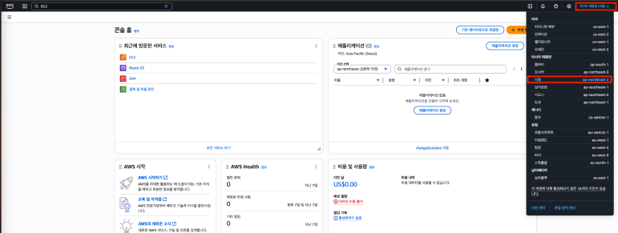   

<br>  

### 2. EC2 인스턴스 생성하기
AWS 메인페이지(콘솔 홈) 상단에 검색창에 `EC2` 를 검색해서 `EC2` 페이지로 이동해줍니다.  
해당 페이지로 접속을 완료했다면 '인스턴스 시작' 버튼을 클릭해서 EC2 인스턴스를 생성해보도록 하겠습니다.

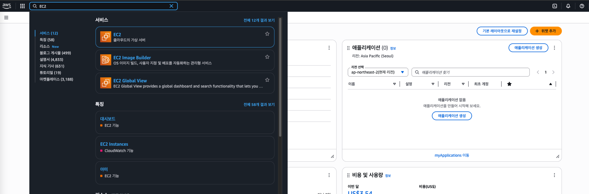

맨 위 상단부터 해당 인스턴스의 이름을 설정해줍니다.  
OS는 Ubuntu 로 진행하고 AMI(Amazon Machine Image) 는 프리 티어 사용 가능으로 설정해줍니다.  
지금 연습용으로는 아래 사양도 큰 무리는 없습니다.
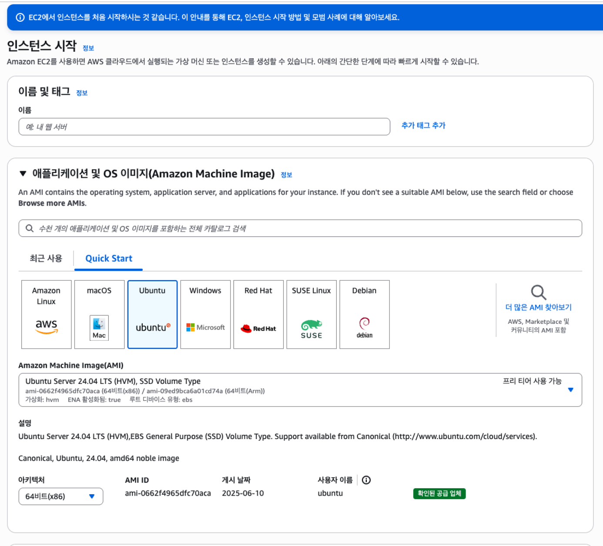

아래로 내리면 키 페어를 설정하는 부분이 나옵니다.  
기존에 사용하던 키가 있다면 그 키를 사용해도 되지만 저는 처음이기에 '새 키 페어 생성' 버튼을 눌러 키 페어를 생성해주겠습니다.  
참고로 해당 키 페어가 존재해야 우리가 인스턴스에 연결할 수(접속할 수) 있습니다.
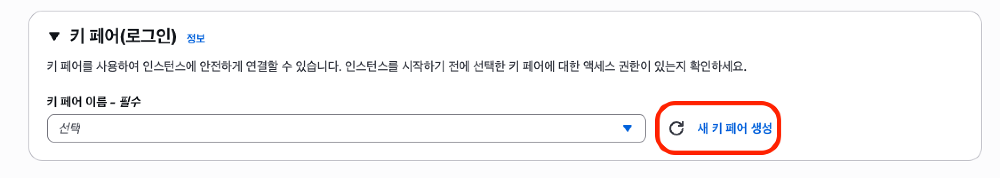

키 페어 이름만 설정해주고 나머지는 기본 Default 값으로 두고 '키 페어 생성' 버튼을 눌러줍니다.  
그러면 키 페어 파일이 다운로드 되는 것을 확인할 수 있습니다. (.pem 파일)

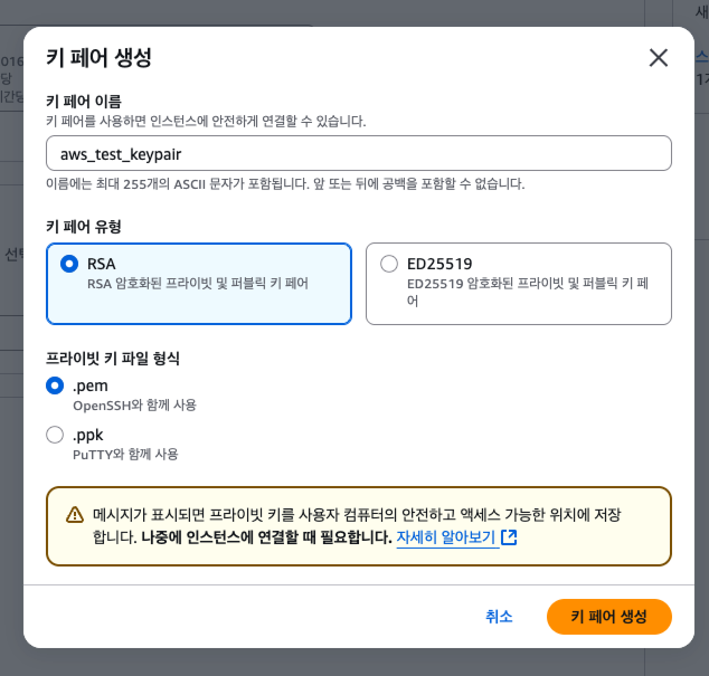

키 페어 생성이 끝났다면 아래로 내려서 네트워크 설정 부분으로 갑시다.  
우리는 보안 그룹을 아직 생성한 적이 없기 때문에 그냥 기본 설정(보안 그룹 생성) 으로 두고 오른쪽에 존재하는 '인스턴스 시작' 버튼을 클릭하여 EC2 인스턴스를 생성하면 됩니다.  

아래 사진에서 '스토리지 구성' 부분에 30GIB 로 설정을 했는데, 기본으로는 20GIB 로 설정되어 있을 것입니다.  
저는 30GIB로 설정해보고 싶어 설정했으나 기본 설정(20GIB)로 설정해도 문제 없는 것으로 알고 있습니다. (비용 나가는게 이 때문인가..?)
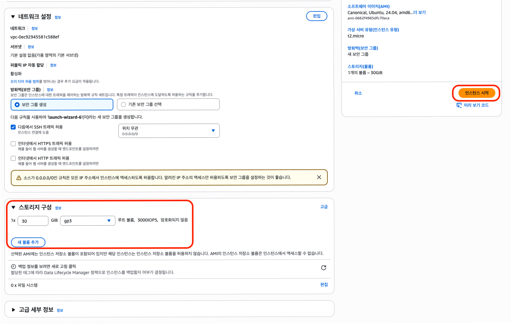

인스턴스를 시작하고 나서 조금 지나고 나면 아래 사진과 같이 우리가 만들어준 인스턴스의 상태가 '실행 중' 으로 바뀐 것을 볼 수 있습니다!  
축하합니다! 첫 EC2 인스턴스를 생성했습니다. 다음은 EC2 인스턴스에 보안그룹을 설정해보겠습니다.
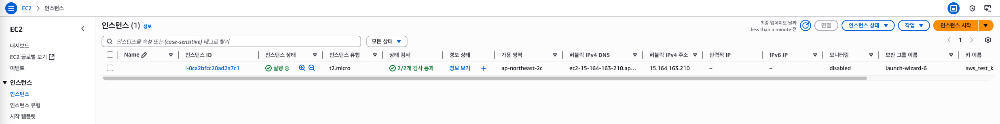

<br><br>  

### 3. EC2 인스턴스에 **보안 그룹 설정** 하기
위 사진에서 우리가 만든 인스턴스를 확인 할 수 있는데, 해당 인스턴스의 ID 를 클릭하면 아래 사진과 같이 해당 인스턴스 요약 페이지로 이동할 수 있습니다.  
인스턴스 요약으로 이동을 했다면 왼쪽 메뉴에 '네트워크 및 보안' - '보안 그룹' 탭을 클릭해줍시다.

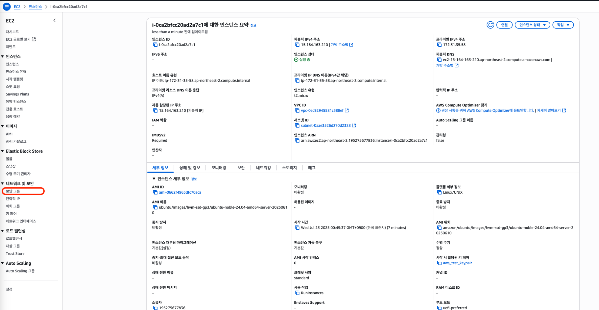

<br>  

그러면 아래와 같이 현재 존재하는(생성되어 있는) 보안 그룹 리스트를 확인할 수 있습니다.  
우리는 따로 하나 만들기 위해 오른쪽 상단에 존재하는 '보안 그룹 생성' 버튼을 클릭하여 줍니다.

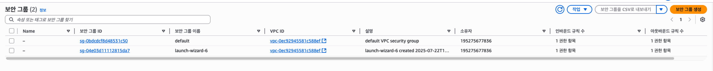

<br>  

아래 사진과 같이 보안 그룹의 이름과 설명을 작성해줍니다.  
그리고 아웃바운드 규칙은 기본으로 세팅되어 있기에 우리는 '인바운드 규칙' 만 설정해줍시다.  
설정하는 방법은 인바운드 규칙 탭에 존재하는 '규칙 추가' 버튼을 클릭하여서 규칙을 추가할 수 있습니다.  
<br>
'인바운드 규칙' 이란 외부에서 내 EC2 인스턴스로 들어오는 네트워크 트래픽을 허용할지 말지를 결정하는 방화벽 규칙입니다.  
쉽게 말하면 EC2 서버로 누구를 들여보낼건지 설정하는것이죠.  
그럼 '아웃바운드 규칙' 은 그 반대이겠죠? EC2 에서 어디로(외부로) 나가는 트래픽을 허용할지 말지 정하는 규칙입니다.  
<br>현재 인바운드 규칙을 4개 설정해줬습니다.  
8080, 22, 80, 443 포트에 대해서 소스는 AnywhereIPv4로 설정해주었는데, 간단하게만 설명하자면 IPv4 형식의 모든 IP 에 대해 허용한다는 뜻입니다.  
웹에 접속하기 위한 8080 포트와 http 80, https 443 그리고 우리가 ssh로 접속하기 위해 443 포트를 열어주었습니다.
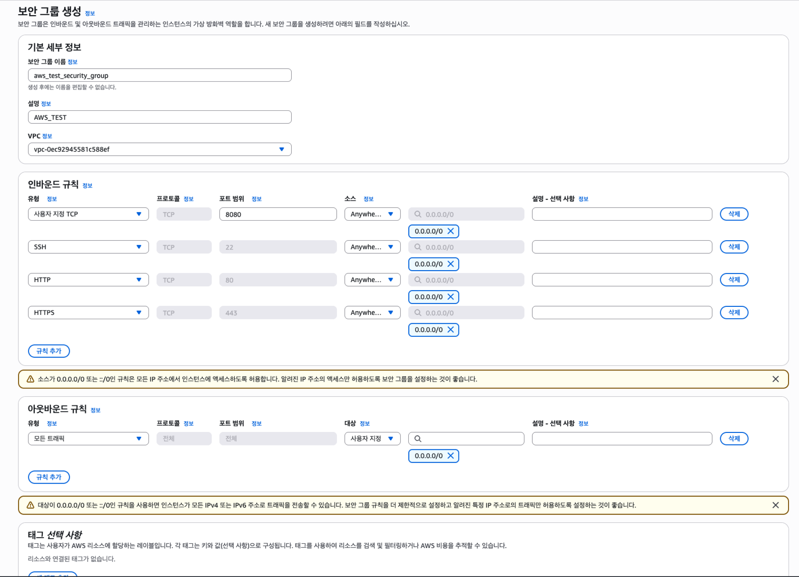

규칙 생성이 완료되었다면, 저장하고 나온 후 다시 요약페이지로 돌아옵시다.  
오른쪽 상단에 '작업' - '보안' - '보안 그룹 변경' 을 눌러줍니다.

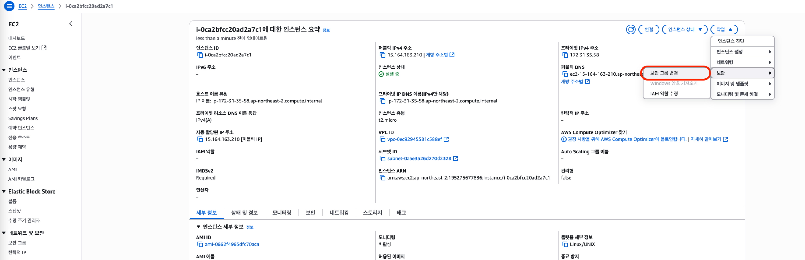


방금 만든 보안 그룹을 클릭하여 저장해줍니다. (연결해주자!)
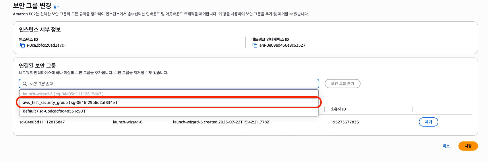

저장이 완료되었다면 요약페이지 중간에 위치하는 '보안' 탭을 눌러서 현재 설정된 규칙을 확인할 수 있습니다.  
이제 EC2 인스턴스에 접속하기 위한 준비는 모두 끝났습니다.  
다음은 EC2 인스턴스에 접속해보고 우리의 스프링부트 프로젝트를 배포하고 실행해보겠습니다.

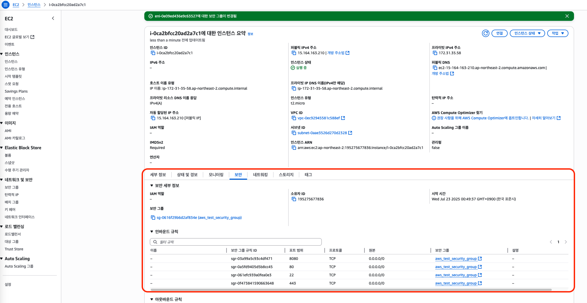
  
<br>  

### 4. EC2 인스턴스 접속 및 스프링부트 프로젝트 배포하기

우리의 인스턴스 페이지에서 '연결' 버튼을 눌러봅시다.
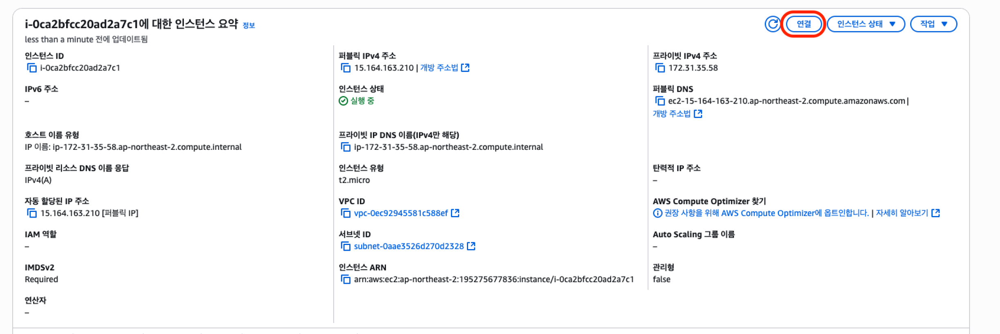

EC2 인스턴스에 연결하는 여러 방법이 존재하는데, 흔히 사용하는 SSH 클라이언트를 사용해서 접속해봅시다.  
연결하는 방법은 AWS에서 아주 친절하게 알려주고 있습니다.  

저는 맥북을 사용하고 있기 때문에 터미널을 열겠습니다.  
윈도우를 사용하고 계시다면 터미널 프로그램을 설치해서 진행하거나 인텔리제이(IntelliJ) 터미널 혹은 EC2 인스턴스 연결을 눌러 연결을 진행해주시면 됩니다.  
  
우선 아까전에 생성했던 키 페어 파일이 존재하는 경로로 이동합니다.  
저는 Downloads 디렉터리에 존재하니까 cd Downloads 명령어를 통해 해당 경로로 이동해주었습니다.  
그리고 AWS 에서 하라는대로 키 파일에 권한을 변경하고 명령어를 입력하여 EC2 인스턴스에 접속하였습니다.
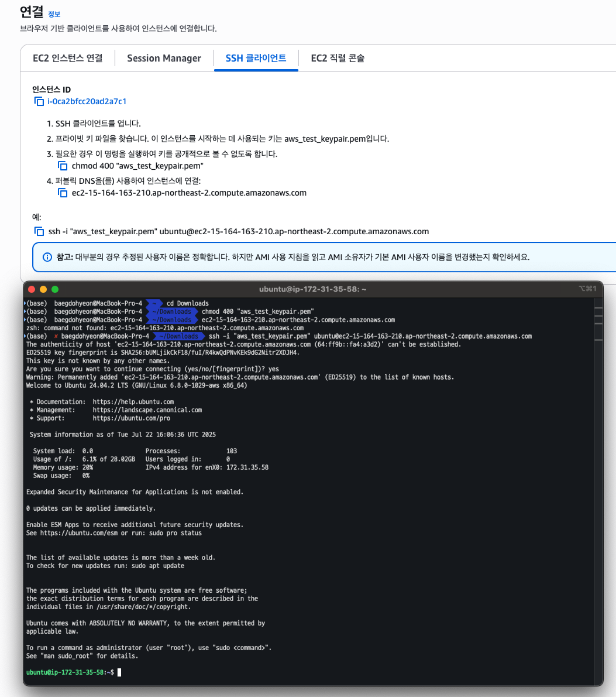


인스턴스에 접속한 후 우리 Git 에 존재하는 스프링부트 프로젝트를 가져오기 위해 git을 설치해줍시다.
  
아래 명령어를 통해 git 을 설치해줍니다.
```angular2html
$ sudo apt-get install git
```

설치가 완료되었다면 아래 명령을 통해 git 의 버전을 확인할 수 있습니다.
```angular2html
$ git --version
```

git 을 설치한 후 아래 사진과 같이 .ssh 경로로 이동해서 다음과 같은 명령어를 입력하여 key pair 를 생성해줍니다.  
```angular2html
$ ssh-keygen -t rsa -C [본인 Git 이메일]
```

아마도 Git 이메일을 입력하는게 맞을겁니다..?  
아무튼 제대로 입력이 되었다면 아래 사진과 같이 뜨고 'id_rsa.pub' 파일이 생성된 것을 볼 수 있습니다.


아래 명령어를 통해 키 값? 을 확인하고 복사 해줍니다.
```angular2html
$ cat id_rsa.pub
```

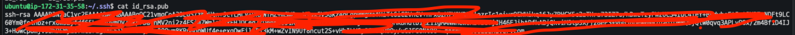

<br>  

이제 호다닥 우리의 Git 페이지로 이동해봅시다.  
사진이 급하게 이동되었는데, Git 페이지 오른쪽 상단에 프로필이미지? 버튼 클릭해서 Setting 버튼을 누르면 아래와 같은 페이지가 나옵니다.  
왼쪽 메뉴 탭에서 'SSH and GPG keys' 탭을 클릭 후 'New SSH key' 버튼을 눌러 SSH key 를 추가해줍시다.
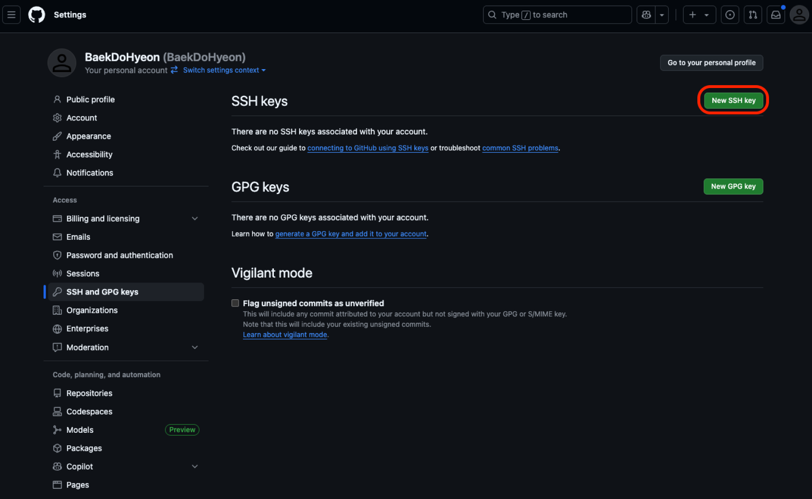

Title 에는 그냥 아무렇게나 작성합시다.  
그리고 Key 부분에는 우리가 아까 위에 EC2 인스턴스에서 접속후 만들었던 key 값을 붙여넣기 해줍니다.  
그리고 'Add SSH key' 을 클릭해 추가해줍니다.
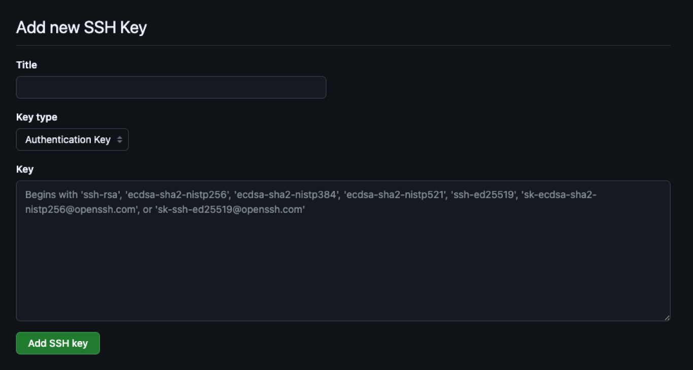


추가가 완료되었다면 우리의 프로젝트 리포지토리로 이동하여 SSH 주소를 복사해줍니다.  
여기는 당연히 아는 부분이겠죠???!
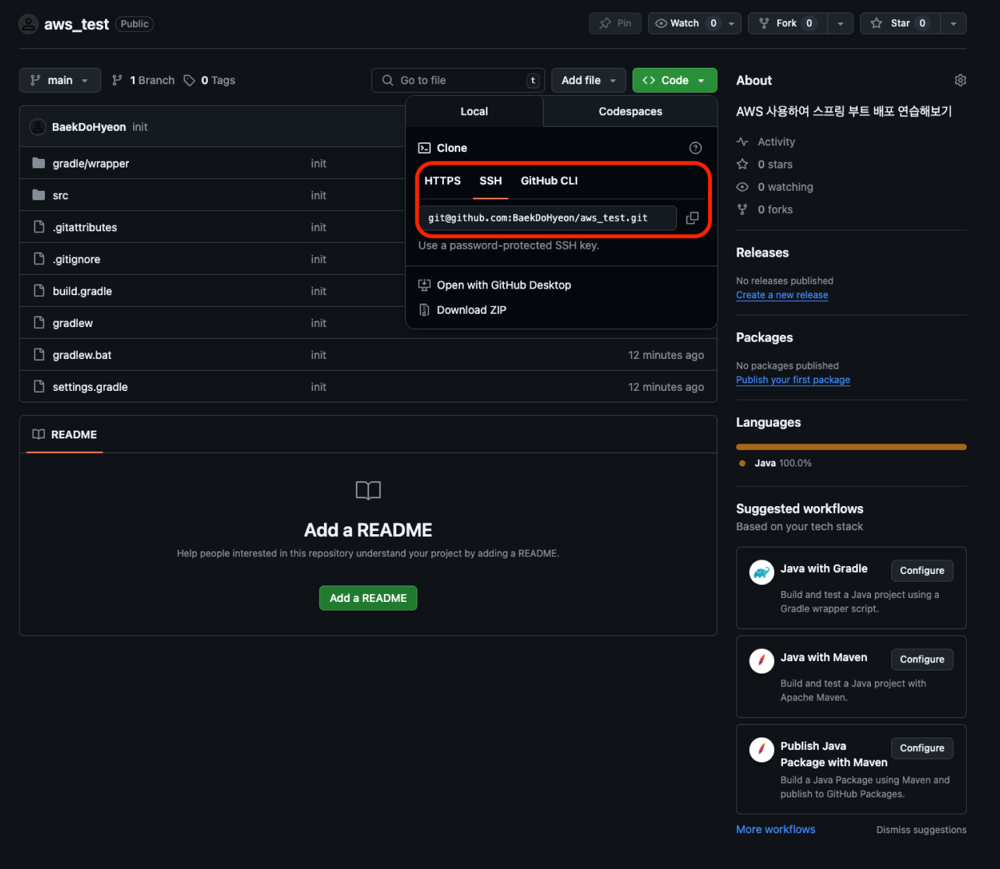


다시 EC2 인스턴스로 돌아와서 아래와 같이 명령어를 입력해줍니다.  
```angular2html
$ git clone [깃 SSH 주소] 
```

명령어를 입력하고 ls 를 통해 폴더를 확인해보면 해당 프로젝트가 clone 된 것을 확인할 수 있습니다.
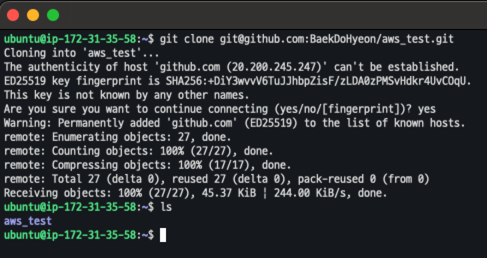


뭐 clone 했다고 웹 서버가 실행되지는 않겠죠?  
해당 폴더로 들어가서 gradlew 파일에 권한을 추가해주고 build 를 진행합니다.  
```angular2html
$ chmod +x ./gradlew  -> 해당 파일에 실행권한 추가

$ ./gradlew build  -> 빌드 진행
```
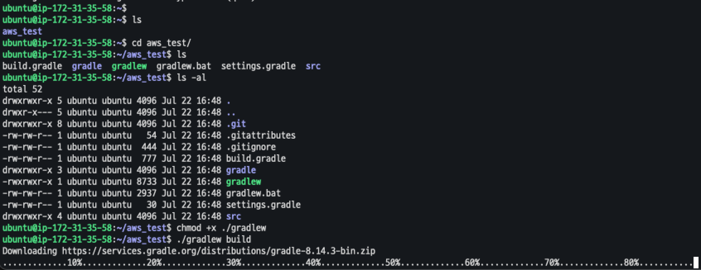

조금 시간이 지나면 아래 화면처럼 빌드가 성공적으로 된 것을 볼 수 있습니다.  
에러가 떨어진 것 같지만 동작만 된다면 넘어가는 개발자이기에 넘어가겠습니다.
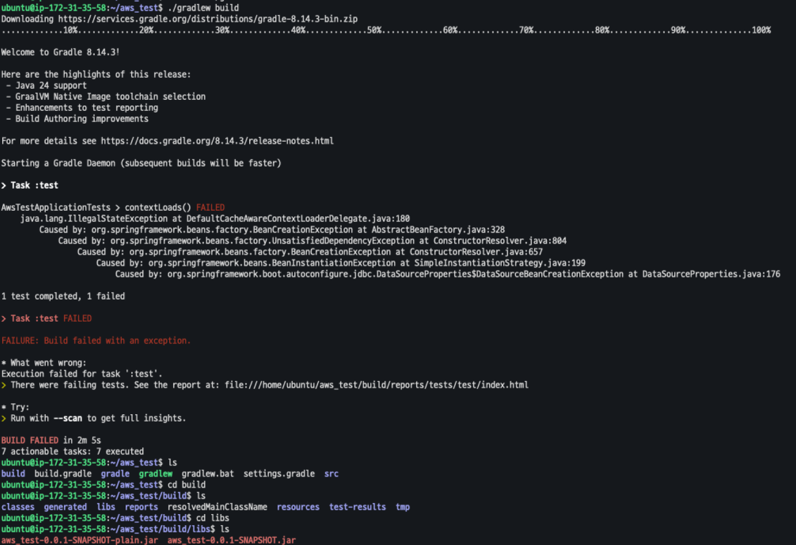

우리의 프로젝트 폴더에서 build/libs 경로로 이동해주면 2개의 jar 파일이 존재합니다.  
아래 명령어를 통해 해당 프로젝트를 실행시킬 수 있습니다.   
이때 SNAPSHOT 뒤에 plain 이 붙지 않은 파일을 실행해주어야 합니다~!
```angular2html
$ nohup java -jar [파일이름].jar
```
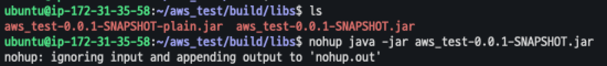


만약 실행되는 로그를 확인해보고 싶다면 아래 명령어를 입력해주면 됩니다.  
```angular2html
$ nohup java -jar [파일이름].jar > nohup.out 2>&1 &
```
이건 해당 명령어를 백그라운드로 실행시킨다는 의미이며 에러로그 또한? nohup.out 에 쌓겠다는 뜻입니다. 아마도요..??  
그 후 아래 명령어를 통해 실시간으로 로그를 확인할 수 있습니다.  
```angular2html
$ tail -f nohup.out
```
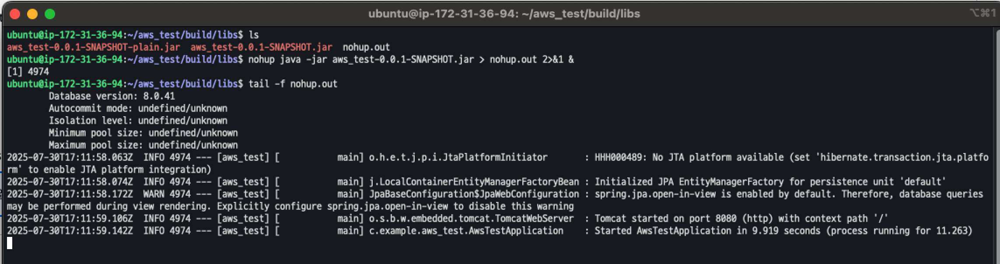