## EC2 ?

---

**EC2(Elastic Compute Cloud)** 는 AWS에서 제공하는 가상 서버 서비스다.  
쉽게 얘기하면 "필요한 만큼 서버를 빌려 쓸 수 있게 해주는 서비스" 이다.  
해당 서비스가 존재하지 않는다면, 우리는 실제로 존재하는 서버를 가지고 있어야 우리가 만든 프로그램을 배포할 수 있다.
  

## EC2 인스턴스 시작하는 방법에 대해

--- 

### 1. AWS EC2 인스턴스를 생성하기 전 *지역(Region)* 설정하기
AWS 콘솔 홈에 접속해서 오른쪽 상단을 보면 지역을 선택할 수 있는 버튼이 존재합니다.  
해당 버튼을 클릭해서 "서울" 로 지역을 설정할 수 있는데요.  
  
이렇게 인스턴스를 생성할 때 지역을 설정하는 이유는 아래와 같습니다.  
- <u>**지연시간(latency) 최소화**</u> : 사용자가 있는 지역과 가까운 지역에 서버를 두면 응답 속도가 빨라집니다.
- <u>**데이터 주권(규제 및 보안)**</u> : 일부 국가는 데이터가 자국 내 서버에 있어야 한다는 법적 요건이 존재합니다.
- <u>**서비스 및 리소스 가용성**</u> : 지역에 따라 사용 가능한 인스턴스 타입과 서비스, 요금이 다를 수 있습니다. 또한 특정 GPU 인스턴스나 최신 기능은 일부 지역에서만 제공될 수 있습니다.
- <u>**재해 복구 및 백업 설계**</u> : 다중 지역에 EC2를 분산 배치하면, 한 지역에서 장애 시 다른 지역으로 트래픽 전환이 가능합니다.

 

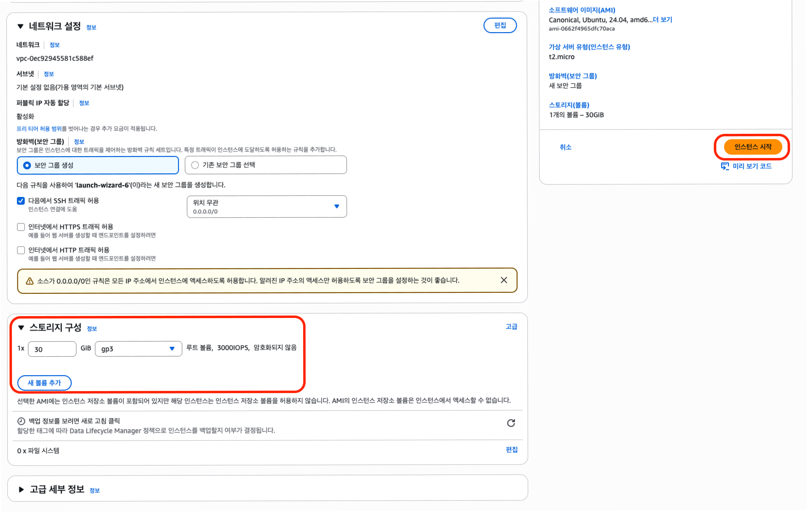

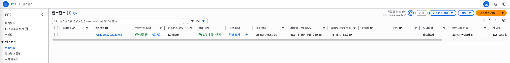

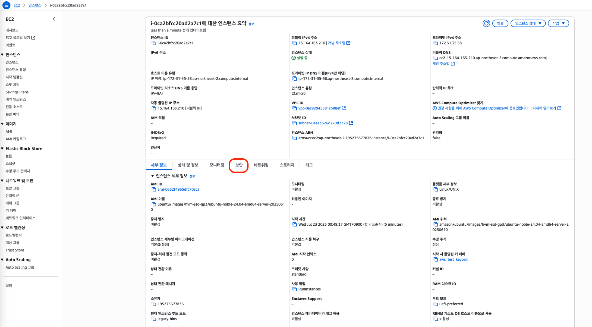

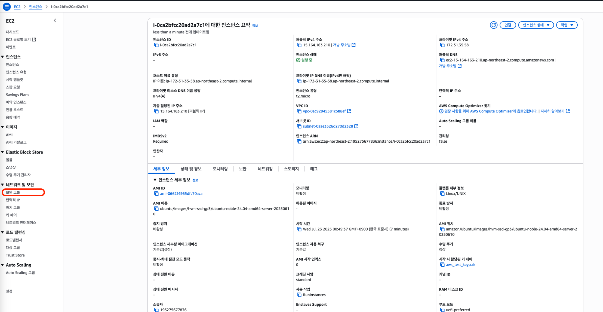

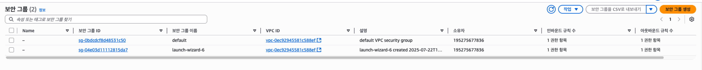

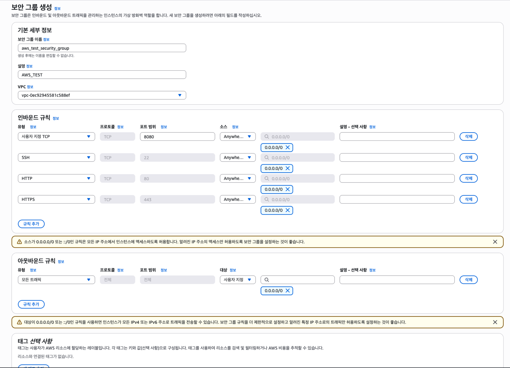

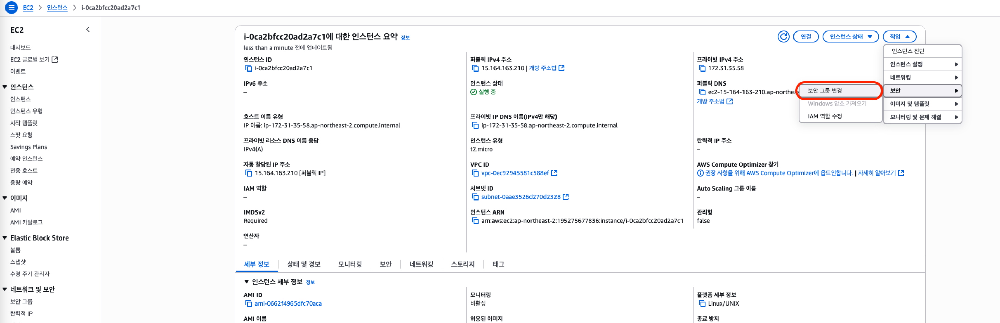

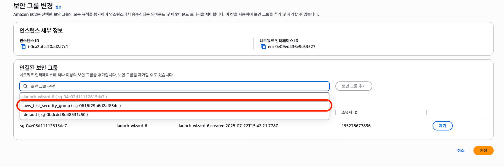

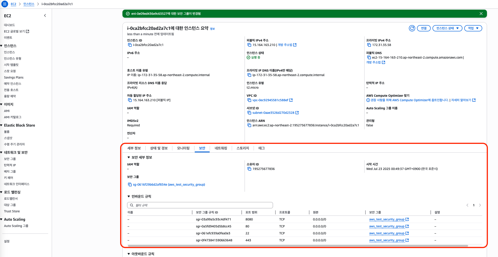

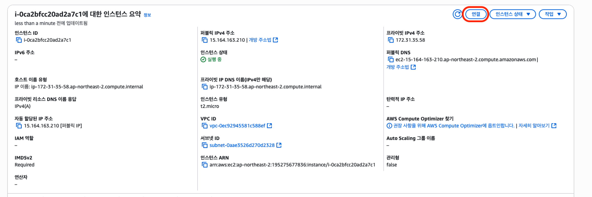

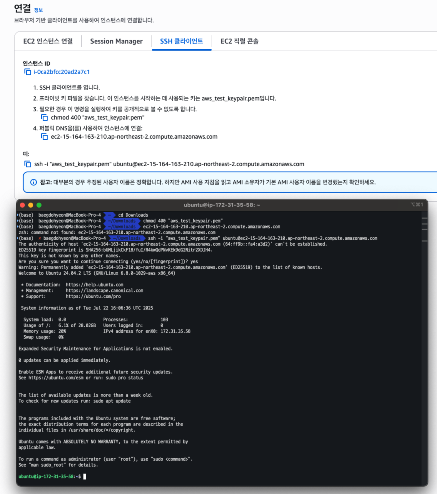

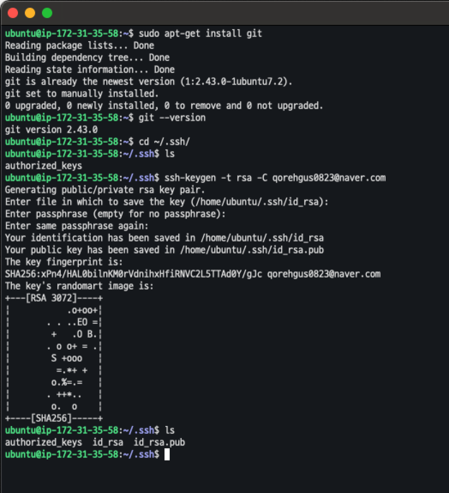

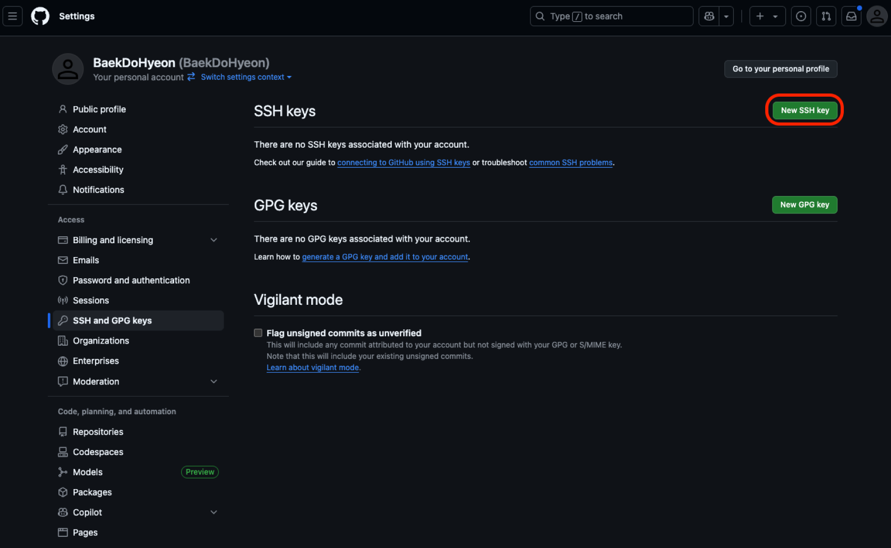

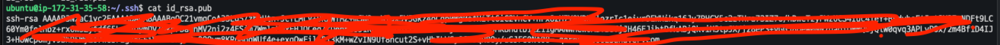

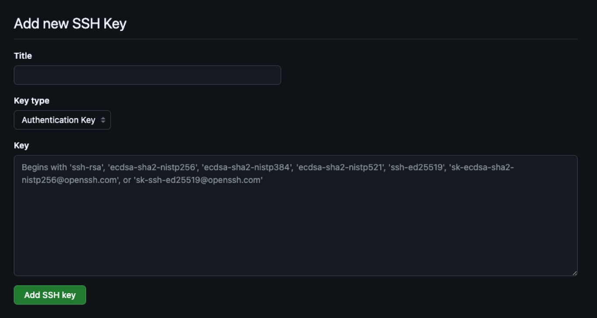

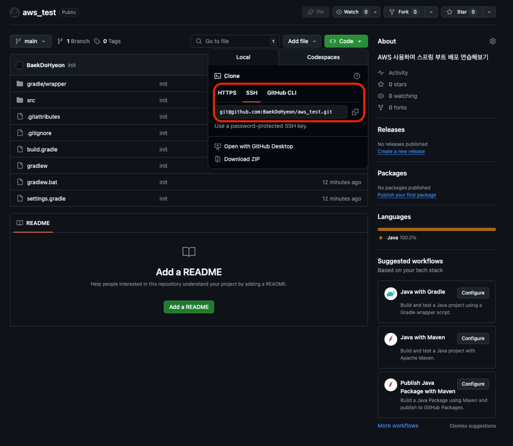

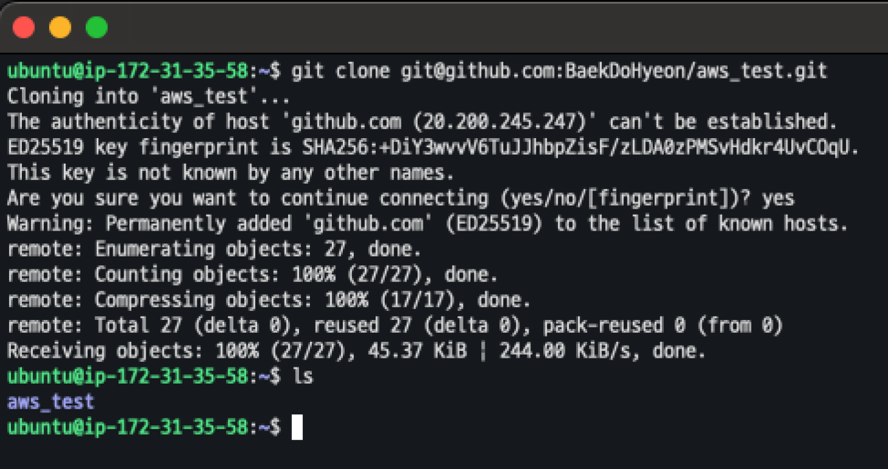

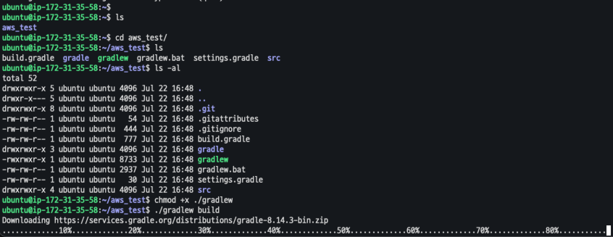

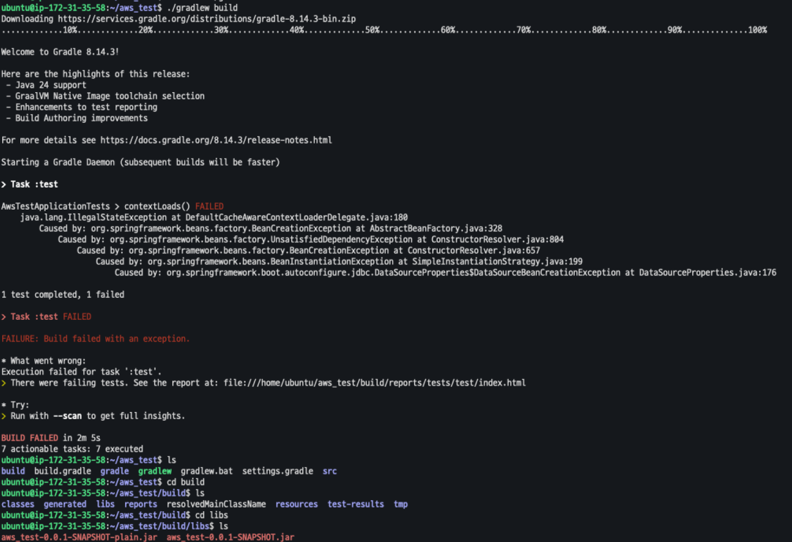

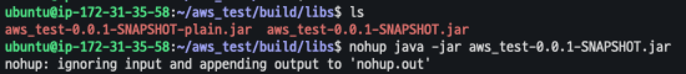

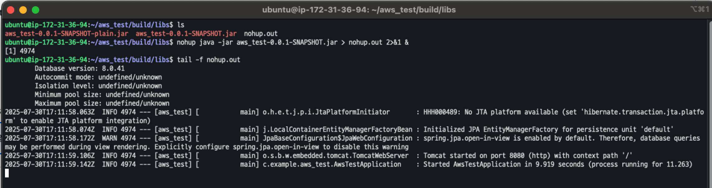