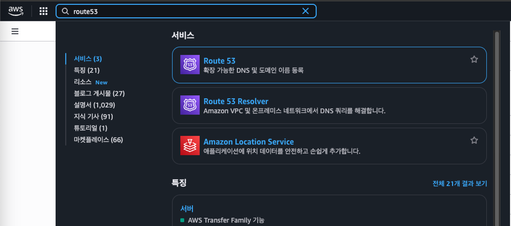
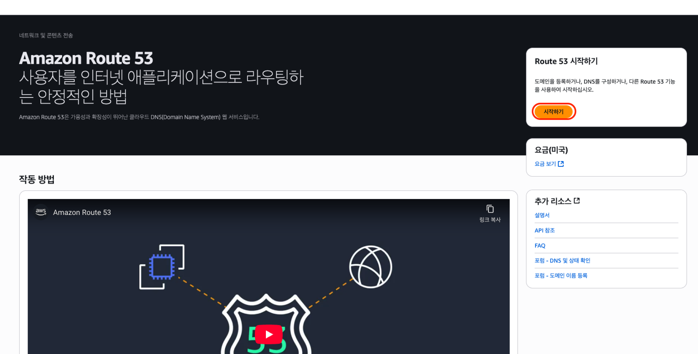
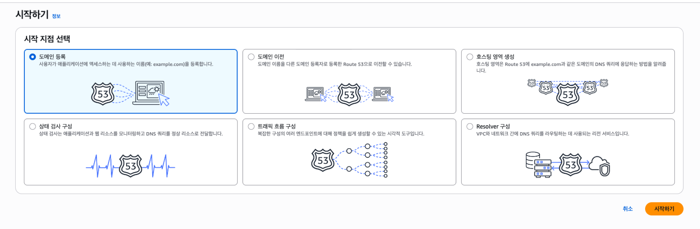
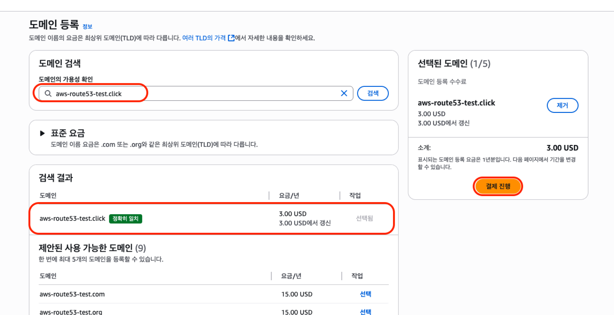
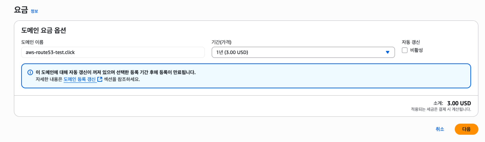
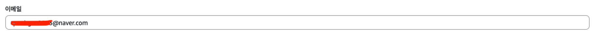
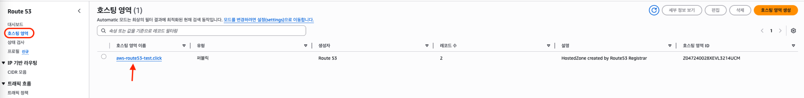
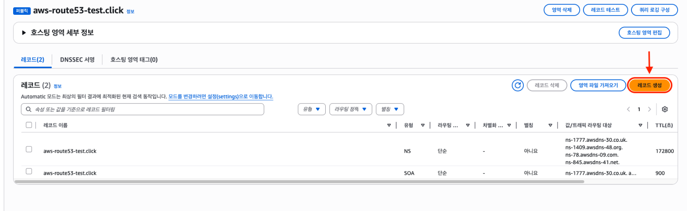
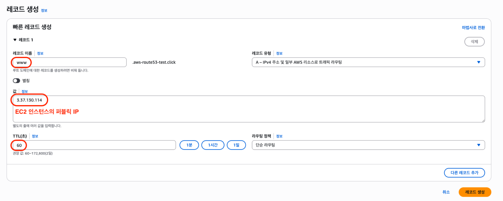
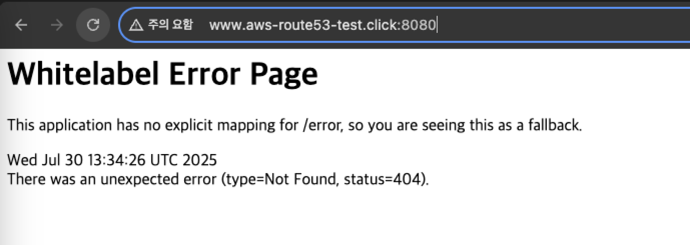

## EC2 인스턴스를 ROUTE53 에 연결하는 방법! (feat. 도메인으로 접속하기까지)

---
  
우선 `ROUTE53` 이 무엇인지 정말 간단하게 설명하고 넘어가보자.  
우리의 EC2 인스턴스를 외부에서 접속하려면 웹 주소에 해당 인스턴스에 퍼블릭 IP를 입력하고 들어가야 한다.  
우리가 평소 자주 들어가는 구글 혹은 네이버에 접속할 때 우리는 도메인으로 입력해서 들어가지 IP를 기억해서 IP를 입력하지 않는다.  
이런게 가능한 이유는 DNS 덕분인데, ROUTE53이 바로 DNS 서비스를 제공해주는 녀석이다.  
우리의 EC2 인스턴스에 도메인을 입혀주는 녀석... 

아무튼 검색창에 route53을 입력하고 들어가보자.

  
오른쪽에 보이는 '시작하기' 를 클릭하자.

우리는 도메인을 등록할 것이기 때문에 '도메인 등록' 을 선택 후 시작하기를 누른다.

도메인을 등록하는 부분이다.  
원래는 도메인을 돈주고 사야하는데, 많은 사람들이 공부 목적으로 사용하는 유명한 무료 도메인 사이트가 존재했다.  
근데 최근부터는 그 사이트에서 무료 도메인을 막아놨다했나? 뭐 암튼 무료 도메인은 안된다는 소리였다.  

공부목적이기에 최대한 저렴한 최상위 도메인(TLD) 인 .click 로 도메인을 검색했다.  
.click 앞에 있는 도메인이름은 여러분들이 맘대로 작성해주면 된다.  
도메인을 검색했다면 가격을 확인하고 결제 진행을 눌러준다.

우리는 공부용도인데 기간이 1년이라니..?  
어쩔수 없다 최소단위였던것 같다.  
대신 오른쪽에 보이는 자동 갱신은 꺼주도록 하자.

  
결제하기전에 자신의 결제 정보를 입력하는 부분이 존재하는데, 다른것들보다 제일 중요한 부분이 '이메일' 부분이다.  
결제가 완료되고 나서 여기에 작성한 이메일로 인증 요청을 보내게 되는데, 이때 요청을 받지 못하면 해당 도메인을 중지시켜버린다고 한다. 

개인 정보까지 입력 후 결제가 완료되면 ROUTE 53 페이지 오른쪽 메뉴에 '호스팅 영역' 탭을 눌러 이동해보자.  
그러면 우리가 방금 만든 따끈따끈한 호스팅 영역이 기다리고 있다. (호스팅 영역이나 도메인이나 같은 의미인가,,?)

오른쪽에 보이는 '레코드 생성' 버튼을 클릭해주자.

레코드 이름에는 www 를 입력해주자.  
값에는 우리가 이전 스텝에서 생성한 EC2 인스턴스의 퍼블릭 IP를 넣어주자.  
퍼블릭 IP는 EC2 인스턴스의 요약페이지에서 확인할 수 있으며 EC2 인스턴스를 종료하고 다시 시작한다면 해당 퍼블릭 IP는 바뀔 수 있으니 인지하고 있자!  
TTL 은 60 으로 했다. 기본값은 400인가 600으로 되어있는데, 그냥 60초로 했다.  크게 상관은 없어보인다.  
작성이 완료 되었다면 '레코드 생성' 버튼을 클릭한다.

인터넷에주소창에 우리가 만든 도메인의 이름을 입력하고 접속해보면 접속이 잘 되는것을 볼 수 있다.  
이전 스텝에서 우리가 EC2 인스턴스를 생성하고 그 안에서 스프링부트 프로젝트를 배포하고 실행했다.  
웹 서버가 실행되고 있지 않다면 웹 접속이 안되니 그 점 알아두자.  

그리고 기억이 날 지 모르겠으나 EC2 인스턴스를 생성할 때 보안그룹에 8080포트를 열어두었던 적이 있다.  
그렇기 때문에 지금 8080 포트로 접근이 가능한것이다!  
물론 지금 따로 페이지를 생성하지 않아서 에러가 발생하지만 말이다. (톰캣 기본 에러페이지)
