## RDS 생성하여 EC2 인스턴스와 외부에서 접속해보기

---  
우선 RDS 를 생성하기 전에 RDS 가 무엇인지 알아보자.

### 0. RDS(Relational Database Service) 
RDS 란 AWS에서 제공하는 클라우드 기반의 관계형 데이터베이스 관리 서비스입니다.  
  
쉽게 얘기하면 MySQL, PostgresSQL, Oracle, SQL Server 같은 데이터베이스를 설치하고 관리하는 일을 AWS가 대신 해주는 서비스라고 생각하면 좋습니다.  
 
만약 RDS 를 사용하지 않고 직접 DB 설치한다면 아래와 같은 단점이 존재합니다.  
- 서버에 MySQL을 수동 설치... 사용자/포트 설정... 보안설정 등등...
- 장애 복구 시에도 직접 로그를 찾아서 분석해야 합니다.
- 확장 할 때에도 서버 사양 교체 후 마이그레이션...
  
위와 같은 이유로 실부에서 <u>"서비스를 빨리 만들고 안정적으로 유지하고 싶다"</u> 라면? RDS 가 훨씬 편하고 안전하기 때문에 좋은 선택지가 될 수 있습니다.

<br>  

### 1. RDS 생성

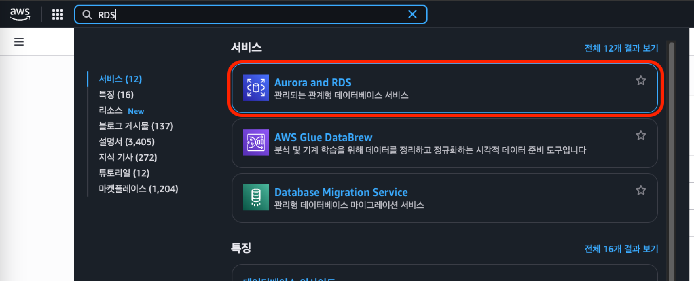

엔진은 MySQL 로 생성하고 템플릿을 "프리 티어" 로 선택합니다.   
그래야 무료로 이용이 가능합니다!

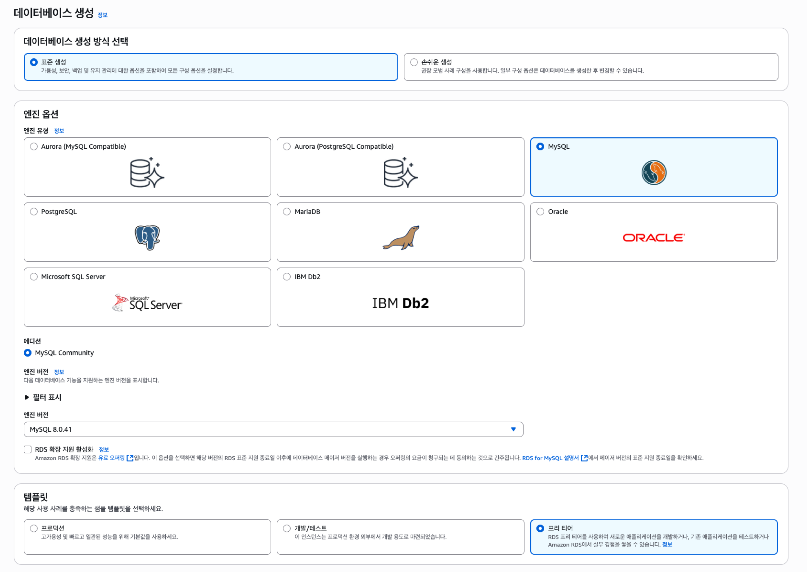

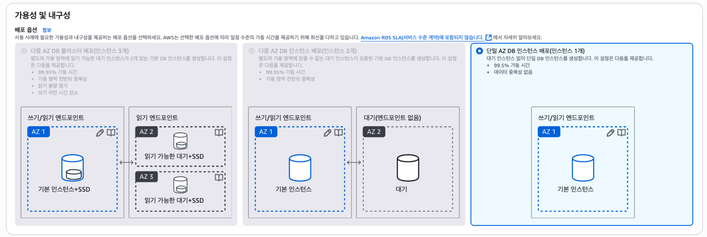

DB 인스턴스 식별자를 입력해주어야 하는데, DB 인스턴스 식별자란 AWS RDS 에서 해당 데이터베이스 인스턴스를 구별하기 위한 이름입니다.  
AWS 콘솔에서 식별하기 위한 용도이지, 실제 DB 이름이랑은 별개라는 점을 알아두세요.

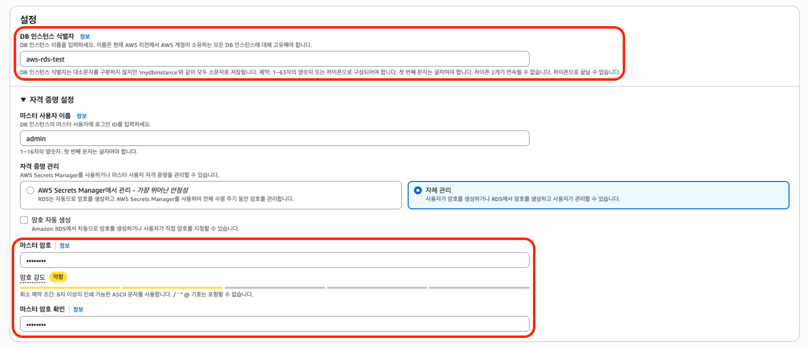

아래부분은 기본 설정값을 유지합니다. 하지만 지금은 외부에서 접속해보는 것도 테스트할 것이기에 "퍼블릭 엑세스" 부분은 '예' 로 변경해줍니다.  
보안상으로는 당연히 문제가 되겠지만, 연습용으로는 충분하며 실무에서는 터널링이라는 기법을 통해 이 문제를 해결합니다.  
이 정도까지만 설정하고 RDS 를 생성해줍니다. 

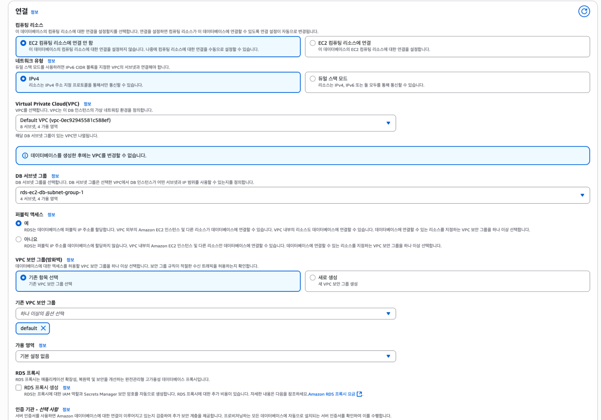

<br>
   
### 2. EC2 보안그룹 설정하기

EC2 에서 RDS 로 접근하기 위해 보안그룹을 설정해줍니다.  
EC2 인스턴스 요약 페이지로 이동하여 왼쪽 메뉴에 존재하는 "보안 그룹" 을 선택해줍니다.

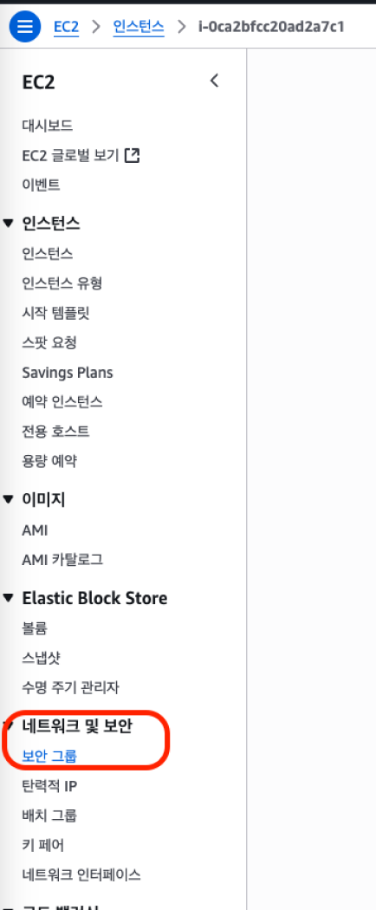  

 이전에 만들어 놓았던 보안그룹을 클릭하여 줍니다.

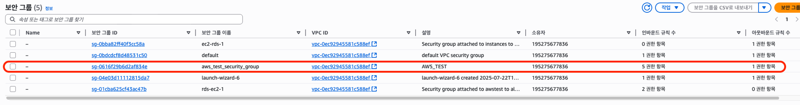

기존 작성되어 있던 인바운드 규칙에 규칙을 하나 더 추가해줍니다.  
MySQL 은 포트를 3306을 사용하고 있으므로 3306 의 포트를 허용해줍니다.  
유형은 "MYSQL/Aurora" 로 선택해주고 소스는 모든 아이피를 허용해줍니다.

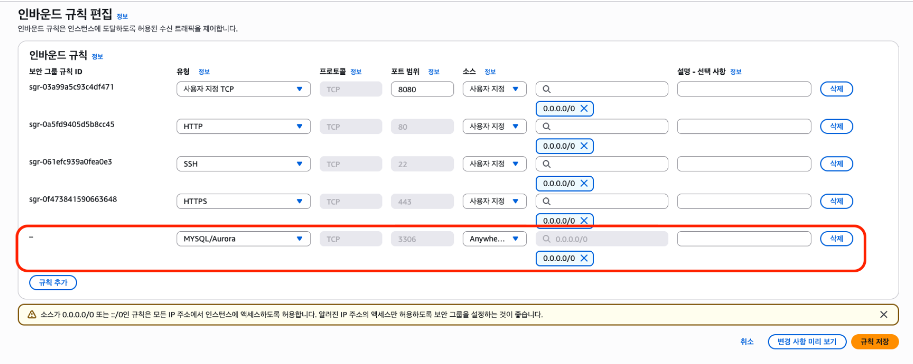

<br>
  
### 3. RDS 보안그룹 설정하기  
EC2 의 보안그룹이 설정이 완료되었다면 RDS 의 보안그룹도 설정해줍시다.

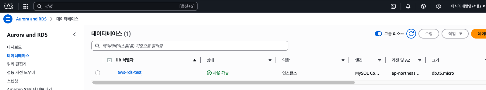

우리가 만들어준 RDS 를 클릭하여 요약(상세) 페이지로 접속하여 "VPC 보안 그룹" 에 활성화 되어있는 보안 그룹을 눌러줍니다.

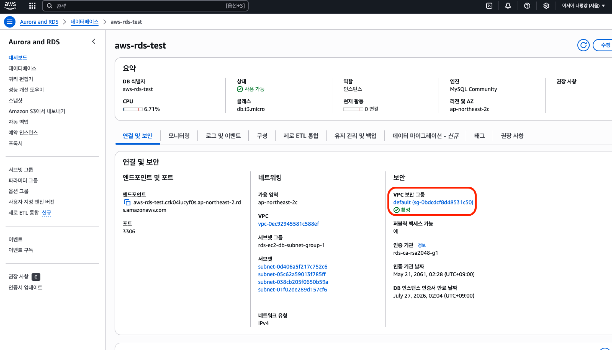

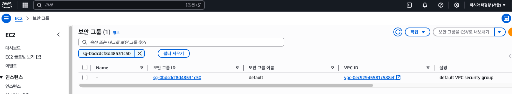

사진은 스킵 되었지만, 위 사진에서 해당 보안 그룹 ID 를 클릭 후 인바운드 규칙을 추가해줍니다.  
보통은 IPv4 소스만 모든 IP로 하여 추가해주어도 되지만 혹시나 IPv6 를 사용하는 경우도 허용해주기 위해 아래와 같이 2개의 규칙을 추가하였습니다.  
EC2와 마찬가지로 유형을 "MYSQL/Aurora" 로 해주시고 소스는 Anywhere로 설정해줍니다.

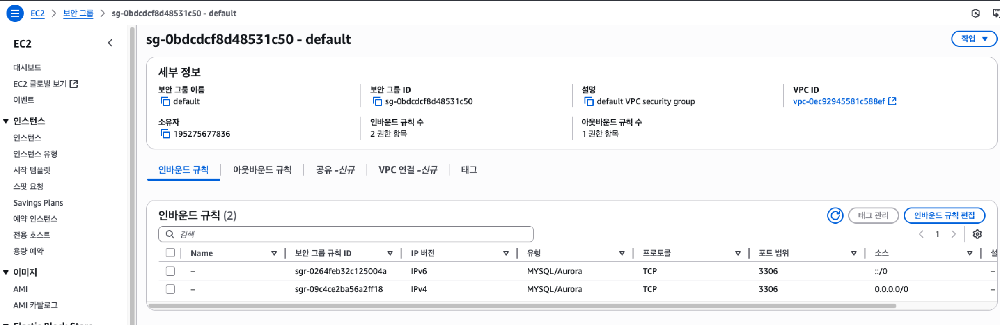

<br>
  

### 4. IntelliJ 에서 RDS 접속하기  

<br>  

우선 콘솔에서 EC2 인스턴스에 접속해줍니다.

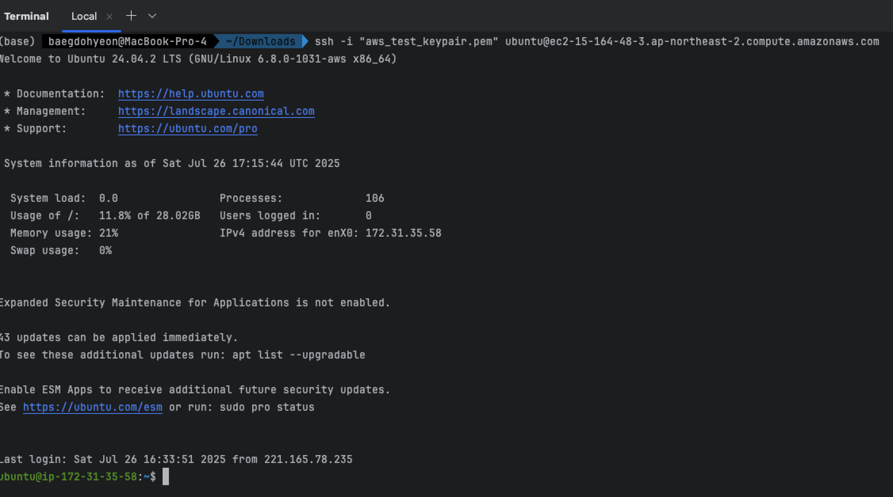

현재 EC2 인스턴스에는 mysql 이 설치되어 있지 않기 때문에 설치해주기위한 간단한 작업을 진행합시다.  

```angular2html
-- 설치 패키지 최신업데이트
$ sudo apt-get update

-- mysql-server 설치
$ sudo apt-get install mysql-server

-- mysql 버전 확인
$ mysql --version 
```
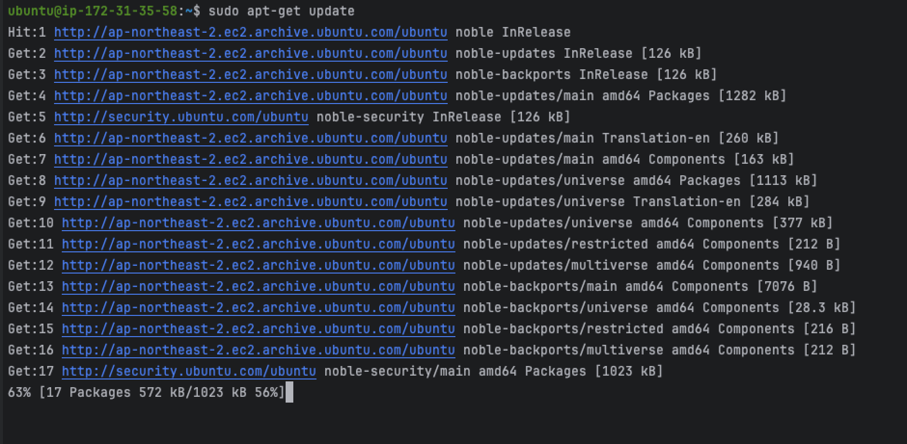

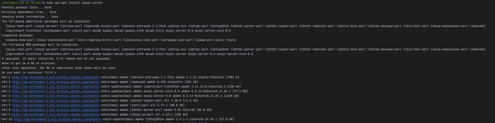

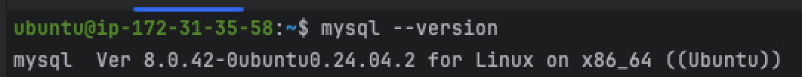

mysql 명령어가 설치가 되었다면 아래와 같이 입력하여 RDS 에 접속합니다.  
```angular2html
$ mysql -h [RDS 엔드포인트] -P 3306 -u [사용자 이름] -p
```
위 명령어를 입력 후 패스워드를 치고 엔터키를 누르면 정상적으로 아래 사진과 같이 접속되는것을 확인할 수 있습니다.  

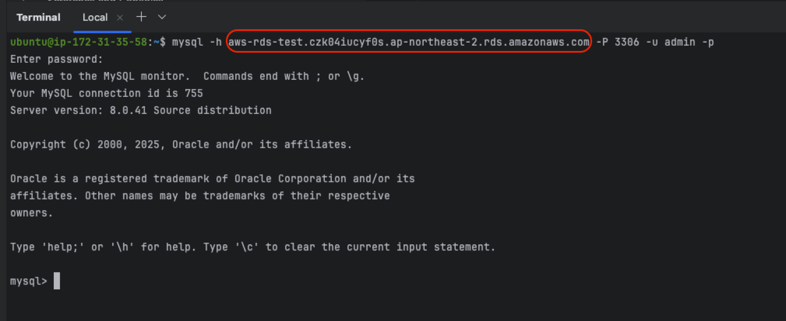  

참고로 RDS 의 엔드포인트는 RDS 요약 페이지에 존재합니다.!
  
<br>  
  
### 5. 로컬(외부)에서 RDS 접속하기  
  
로컬에서 RDS 에 접속하기 위해 DBeaver 를 통해 접속을 시도했으나  
아래 사진들처럼 연결 실패 에러가 발생하며 접속이 되지 않는 것을 볼 수 있습니다.
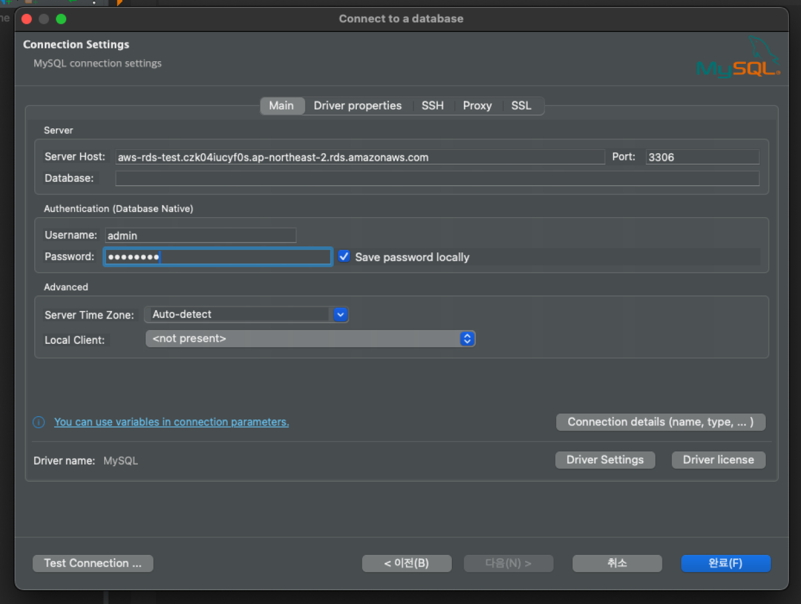

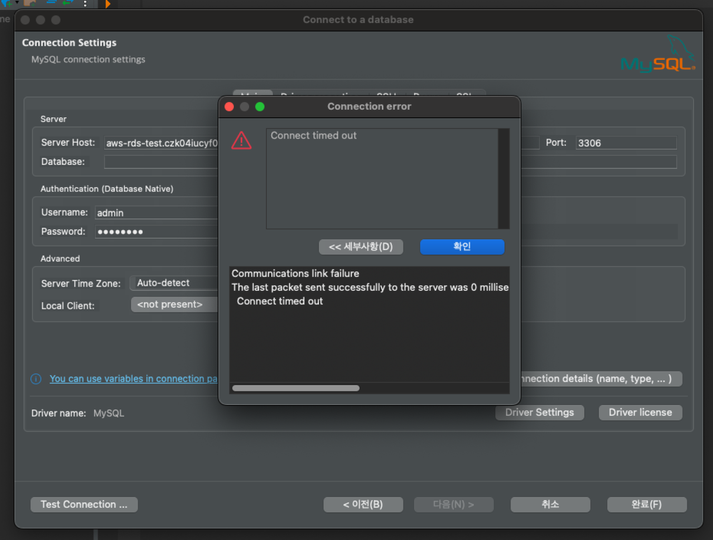

분명 RDS 를 처음 생성할 때 "퍼블릭 액세스" 를 허용해주었으며 인바운드규칙또한 모든 IP 를 허용했는데 접속이 안된다.  
<br>
문제는 바로 RDS 인스턴스가 프라이빗 서브넷에 위치해 있다는 점이였다.  

프라이빗 서브넷은 외부 인터넷으로의 접근이 차단되므로, 외부에서 접속이 불가능한 상태였다.  

이 문제를 해결하기 위해 VPC 를 검색하여 서비스를 사용해보자.  
<br> 

### VPC(Virtual Private Cloud) 란..?  
  
<u>**AWS 에서 네트워크 환경을 직접 구성할 수 있게 해주는 가상의 네트워크 공간**</u>입니다.  

그리고 서브넷이라는 것은 VPC 안을 더 작게 나눈 네트워크 구역입니다.
- **퍼블릭 서브넷** : 인터넷 게이트웨이를 통해 외부 인터넷과 통신이 가능하다.
- **프라이빗 서브넷** : 인터넷 게이트웨이가 없어서 외부와 직접 통신이 불가능하다.

우리의 RDS 는 현재 프라이빗 서브넷으로 설정이 되어있을 것이기 때문에 이를 퍼블릭 서브넷으로 변경하고 로컬에서 접속해보겠습니다.

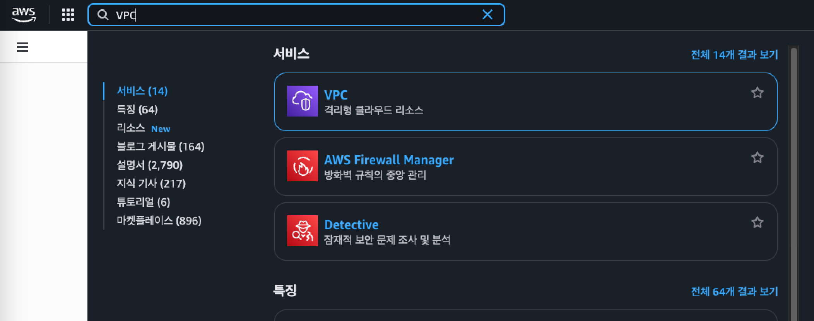

왼쪽 메뉴에 라우팅 테이블탭으로 이동한다. 

  여기서는 사진이 생략되었지만, 우리가 사용하고 있는 RDS 에 설정된 라우팅 테이블은 RDS 인스턴스 대시보드(요약) 에서 확인이 가능하다.

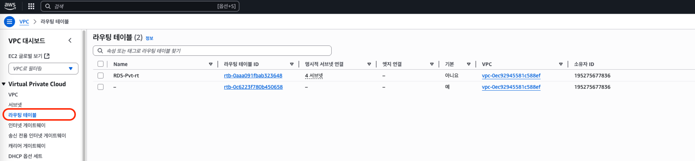

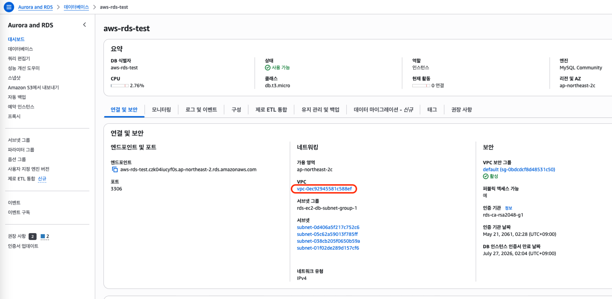

해당 라우팅 테이블을 찾았다면 눌러서 세부 정보로 이동하고 "라우팅" 탭에 "라우팅 편집" 버튼을 클릭한다.

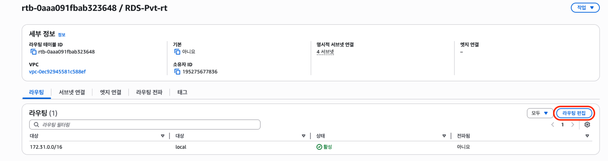

처음에는 아무것도 설정되어 있지 않을 것이다. (인터넷 게이트웨이 X)  

"라우팅 추가" 버튼을 클릭해주고 모든 IP와 대상을 선택해주고 변경사항을 저장한다.  
 
이렇게 설정을 마치게 되면 인터넷 게이트웨이가 존재하기 때문에 외부 인터넷과 통신이 가능하다. 즉 퍼블릭 서브넷으로 변경한 것이다.  

*프라이빗 서브넷은 보안이 중요한 리소스(RDS, 내부 백엔드 등) 를 외부와 격리하기 위해 사용합니다.   
EC2 웹서버 같은 경우는 외부 요청을 받아야 하기 때문에 퍼블릭 서브넷이 위치시킵니다.*

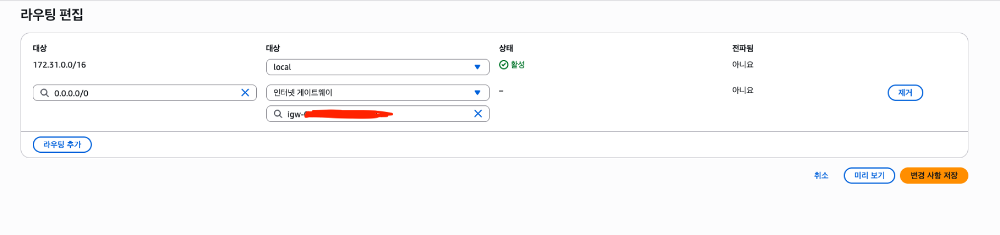

이제 다시 로컬에서 접속을 시도해보면 정상적으로 연결이 되는 것을 확인할 수 있다.

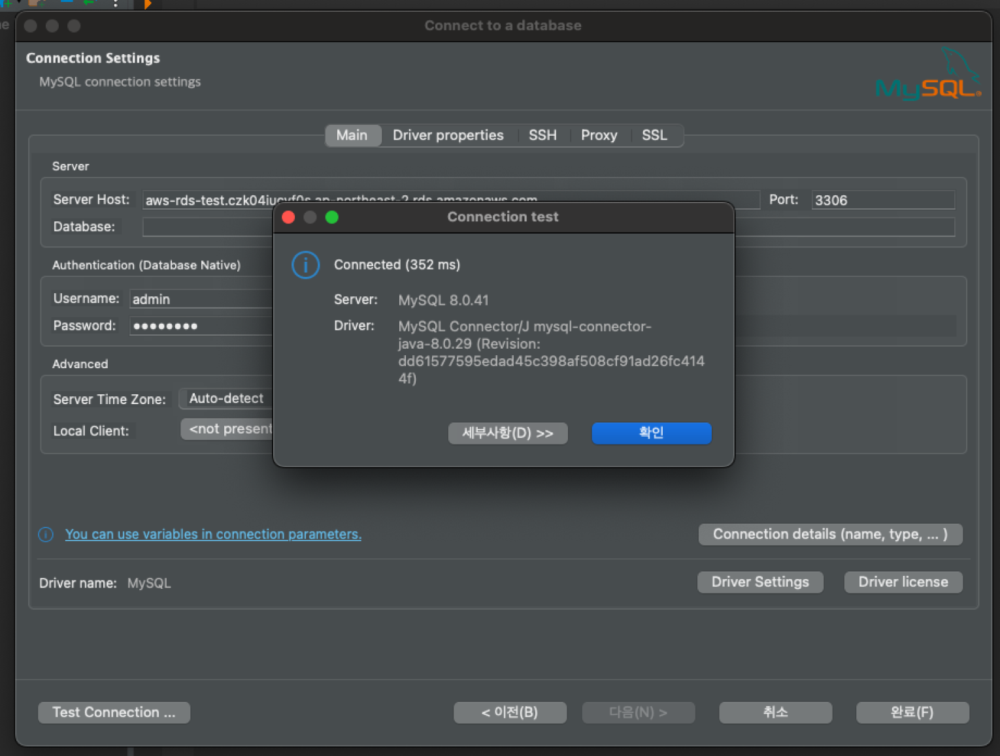


