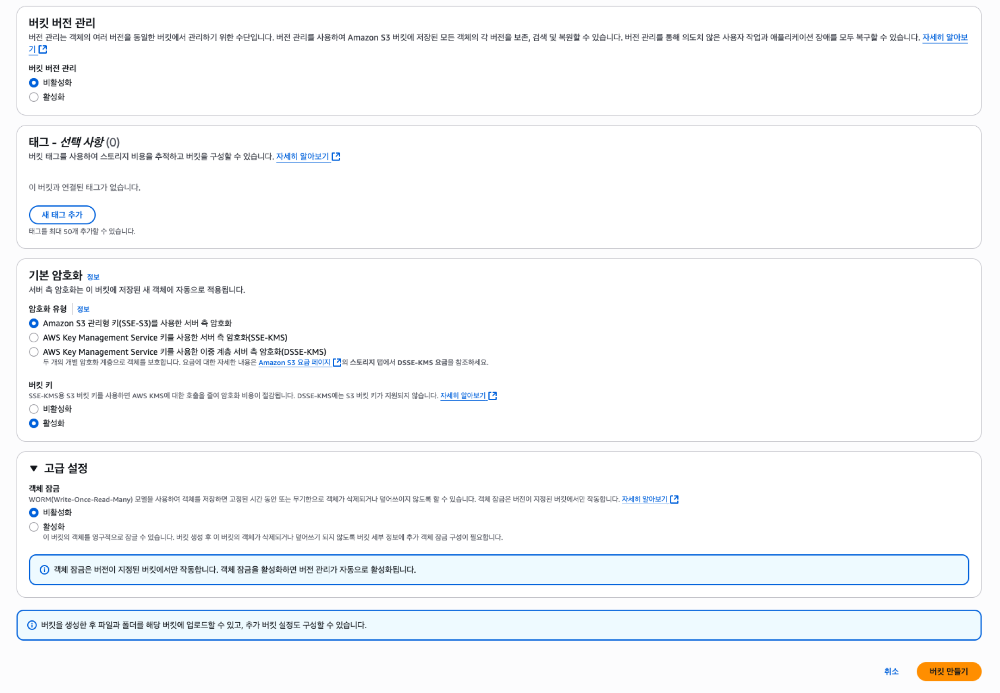
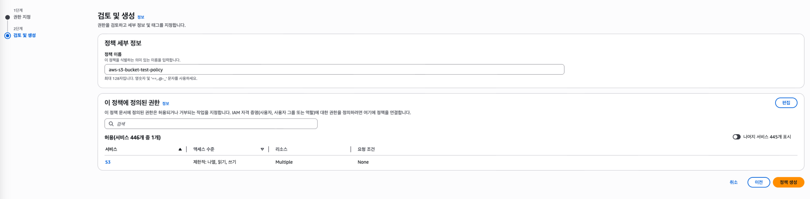

## S3 생성하고 EC2 와 연결하기

--- 

### 0. S3 (Simple Storage Service) 란? 
S3 (Simple Storage Service) 는 AWS 에서 제공하는 **클라우드 객체 저장소 서비스** 입니다.  
간단하게 얘기하면 이미지, 동영상, 문서, 백업 파일 등 다양한 데이터를 인터넷에서 저장하고 꺼내 쓸 수 있는 공간입니다.  

### 핵심 특징
- **객체 단위 저장** : 파일 하나하나를 "객체(Object)" 로 저장합니다.
- **버킷(Bucket)** : 객체들을 담는 일종의 폴더입니다. 버킷을 먼저 만들고 그 안에 객체를 넣습니다.
- **무제한 저장 용량** : 저장 용량에 제한이 없고, 사용한 만큼만 비용이 청구됩니다.
- **고가용성, 내구성** : 데이터를 여러 AZ(가용 영역) 에 복제해서 안정적으로 보관할 수 있습니다.  
- **정적 웹 호스팅** : HTML 같은 정적 웹 사이트를 S3 에 호스팅 할 수 있습니다.

---

<br>  

### 1. S3 생성 (버킷 생성)

 


S3 도 EC2 인스턴스와 마찬가지로 생성하기전 오른쪽 상단에서 지역을 선택을 선택해줍니다.  

그리고 "범용 버킷" 에서 "버킷 만들기" 를 클릭하여 버킷을 만들어줍니다. (버킷이라는 용어는 위에서 설명하였음)


버킷 이름을 작성해주고 객체 소유권은 ACL 비활성화됨으로 설정한다.  
그리고 일단은 퍼블릭 액세스 차단 설정을 풀어주었다.  
단순히 지금은 생성 및 연결 테스트를 하기 위함이기에 차단을 풀어주었고, 생성 이후에 설정값을 변경할 수 있으니 크게 신경쓰지 않아도 될 것 같다.


아래 사진에 나오는 옵션들은 따로 건들지는 않고 기본적으로 세팅 되어있는 옵션을 사용했습니다.  

버킷 버전 관리도 비활성화로 진행하였는데, 만약 활성화 한다면 버전별로 관리할 수 있다지만 비용이 더 많이 든다고 합니다.

암호화는 기본 암호화로 설정하였는데, 이럴경우 버킷에 저장되는 객체(파일 등)들은 암호화를 해서 저장합니다.  
객체를 다운로드할 때에는 복호화해서 제공해줍니다.



이후 "버킷 만들기" 를 누르면 아래와 같이 버킷이 생성된 것을 확인할 수 있습니다.


<br>  

### 2. 버킷 정책 수정

이제 우리가 만든 버킷에 정책을 줄 것이다. 버킷을 클릭하여 "권한" 탭으로 이동한다.  
아래에 보이는 "버킷 정책" 에서 "편집" 버튼을 클릭하여 버킷의 정책을 변경 해줄 것 이다.


왼쪽에 보이는 버킷 ARN 을 클릭하여 복사해주고 오른쪽 상단에 위치한 "정책 생성기" 를 클릭해준다.


그럼 아래와 같은 창이 나오는데, 아래와 같이 입력해주면 된다.  

- **Type of Policy** : S3 Bucket Policy -> 정책 이름
- **Effect** : Allow
- **Principal** : * -> 정책의 적용 대상, 즉 누가 이 버킷에 접근할 수 있는가? 전체 허용(*)
- **Actions** : GetObject, PutObject -> 조회랑 업로드 관련하여 권한 허용
- **Amazon Resource Name(ARN)** : 아까전에 복사했던 S3 버킷의 <u>**'ARN 주소/*'**</u> -> 이때 주소 맨뒤에 /* 를 붙여주어야 한다.

이후에 "Add Statement" 클릭


그럼 아래와 같이 JSON 형식으로 정책을 만들어주는데, 이걸 복사하자.


아래 사진처럼 정책 부분에 해당 JSON 정책을 붙여넣기하고 저장하면 성공이다.


[ 아래는 저장완료 된 사진 ]


정책이 생성되었다면 해당 버킷의 페이지로 이동해서 "폴더 만들기" 를 하여 "images/" 를 생성해준다.  
사진은 생략되어버렸지만..? 별도의 설정은 필요없기에 이정도면 충분하다고 본다.


<br>  

### 3. IAM 역할 생성

검색창에 IAM 을 입력하고 이동한 후 왼쪽 메뉴에 "역할" 탭으로 이동한다.


EC2 인스턴스에 부여할 역할을 생성하는 것입니다.  
아래와 같이 선택해주세요.


역할의 이름과 설명을 작성하고 생성을 완료합니다.


이전에 만들어놓은 EC2 인스턴스에 요약 페이지로 이동해서 오른쪽 상단에 존재하는 **"작업"** - **"보안"** - **"IAM 역할 수정"** 을 클릭해줍니다.


우리가 방금 만들어준 IAM 역할을 추가해서 업데이트 해줍니다.


업데이트가 되었다면, 내가 만든 IAM 역할 페이지로 이동해줍니다.  

저희는 지금 역할을 생성했을 뿐 그 역할을 가진 계정이 어떤 권한을 가지고있는지에 대한 내용을 추가한적은 없습니다.  
그러한 권한을 추가하기 위해 가운데에 보이는 **"권한 추가"** 버튼을 클릭해줍니다.


권한을 지정해줍니다.  
S3에 대한 나열,읽기,쓰기 권한을 하나씩 추가해줄겁니다.  
- **나열** : ListBucket
- **읽기** : GetObject
- **쓰기** : PutObject


다음 설정을 하기전에 우리가 만든 S3 페이지로 이동해서 "속성" 탭에 존재하는 **Amazon 리소스 이름(ARN)** 을 복사해줍니다.


ARN 을 복사했다면, 다시 권한 설정을 이어서 진행하겠습니다.  
ARN 지정하는 부분이 두 부분 나오게 됩니다.    

처음 나오는 ARN 지정하는 부분에서는 버킷(Bucket) 이름과 리소스 ARN 주소를 넣어줍니다.  
두 번째 입력에는 버킷(Bucket) 이름과 ObjectName 그리고 리소스 ARN 을 입력해줍니다.  
이때 ObjectName 에는 * 을 넣어주시는데 이유는 모든 오브젝트에 대해 권한을 허용할 것이기 때문입니다. (선택사항)  
리소스 ARN 에는 ARN 뒤에 "/*" 을 추가로 입력해주셔야 합니다.  
이유는 해당 버킷 하위의 모든 경로에 존재하는 요소들에 대해 권한을 부여하기 위함입니다. (확실하진 않습니다 ㅎㅎ..)


ARN 까지 추가가 완료되었다면 정책이름을 설정해주고 정책을 생성합니다.



  

<br>  

### 4. EC2 에서 S3 연결하기

<br>  
우리의 EC2 에 접속한 후 아래의 명령어를 입력해 unzip 을 설치해줍니다.     

해당 과정을 진행하는 이유는 awscli 를 설치하기 위함입니다.  

```angular2html
// 이전에 업데이트를 했다면 생략 가능
$ sudo apt update 

$ sudo apt install unzip -y
```


이후에는 사진이 존재하지 않지만 awscli 를 설치해줍시다.  
원래는 쉬운 방법이 존재했지만, ubuntu 버전과 awscli 버전 이슈로 crul 을 통해 파일을 다운받아야 합니다. (feat. 공식설치법)
```angular2html
$ curl "https://awscli.amazonaws.com/awscli-exe-linux-x86_64.zip" -o "awscliv2.zip"

$ unzip awscliv2.zip

$ sudo ./aws/install

//설치 확인
$ aws --version
```

위 명령어를 통해 awscli 를 설치완료했다면, aws 에 접근해보도록 하겠습니다.  
```angular2html
$ aws s3 ls [S3 버킷 이름]
```

위 명령어를 통해 우리가 만들어준 폴더를 확인할 수 있습니다.


다음은 파일을 하나 만들고 해당 S3 버킷에 업로드를 진행해보겠습니다 
```angular2html
// text.txt 파일을 하나 만들어줍니다.
$ vim text.txt

$ aws s3 cp ./text.txt s3://[S3 버킷 이름]/[폴더 이름]/

// 해당 명령어를 통해 파일 업로드 확인
$ aws s3 ls [S3 버킷 이름]/[폴더 이름]
```
아래 결과를 보면 제가 만들어준 파일인 text.txt 가 업로드 된 것을 확인할 수 있습니다.


  
AWS 웹에서 해당 파일의 업로드를 확인할 수 있습니다.

