## CI/CD 파이프라인 구축해보기.

--- 
  
### *1. 배포란?*  
내 컴퓨터에서 돌아가는 프로그램을, 사람들이 사용할 수 있는 서버에 올리는 것을 말합니다.  
현재는 EC2 에 스프링부트 프로젝트가 올라가 있는데, 이게 이미 1차 배포이다.  
여기서 문제는, 코드를 바꿀 때마다 직접 서버에 접속해서 파일을 옮기고 서버를 껏다 켜는게 귀찮고 실수를 유발 할 수 있다는 것 입니다.
  
<br>

### *2. CI / CD ?*  
CI (Continuous Integration) : 코드가 바뀔 때마다 자동으로 테스트하고, 문제가 없는지 확인하는 과정  
CD (Continuous Delivery/Deployment) : 문제가 없다면 자동으로 서버에 배포까지 해주는 과정  

흐름으로 보자면, 내가 push 를 진행하면 자동으로 <u>**빌드 & 테스트 -> 서버에 올림 -> 서비스 재시작 -> 정상동작 확인**</u> 을 진행합니다.

<br>  

### *3. /health 와 /version*
배포 자동화의 마지막 단계는 **"정상적으로 잘 올라왔는지"** 확인하는 것 입니다.  
**/health** : 서버가 잘 켜졌는지 확인  
**/version** : 올린 버전이 맞는지? (예: 이번에 수정한 코드가 진짜 반영되었는지)  
  
우리가 흔히 알고있는 자동화 도구(예: GitHub Actions)가 이 두 주소를 호출해서 정상인지 그리고 코드의 버전이 맞는지 확인을 하고 판단합니다.


--- 

## 0. 들어가기전에...    
<br>
EC2 에 자동배포를 하기전에 로컬에서 Docker 를 통해 스프링 부트 프로젝트를 실행해보자.  
이 과정을 통해 어떤 흐름이 EC2 에서 일어나는지, 그리고 어떤 과정을 자동화하려고 하는 것인지에 대해 이해할 수 있다.  
  
우선 JAR 빌드를 진행한다.  
아래와 같은 과정을 거치면 build/libs 폴더 안에 .jar 파일이 생기게 됩니다.  

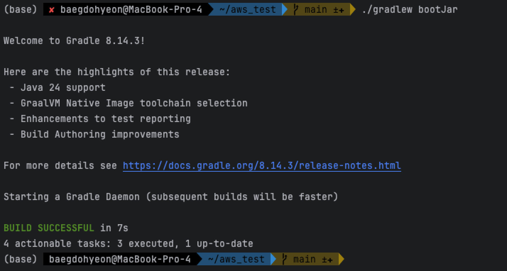

bootJar는 스프링부트 애플리케이션을 실행 가능한 JAR 파일로 만드는 Gradle 작업입니다.  
스프링부트 프로젝트를 빌드하면 **내장 톰캣** 과 앱 코드가 한 파일 안에 들어간 **실행형 JAR** 을 만들 수 있습니다.
  
다음은 도커 이미지를 빌드합니다.  
아래에서 사용된 명령어에서 myapp 은 이미지 이름을 나타내고 1.0 은 태그로서 버전을 의미합니다.  

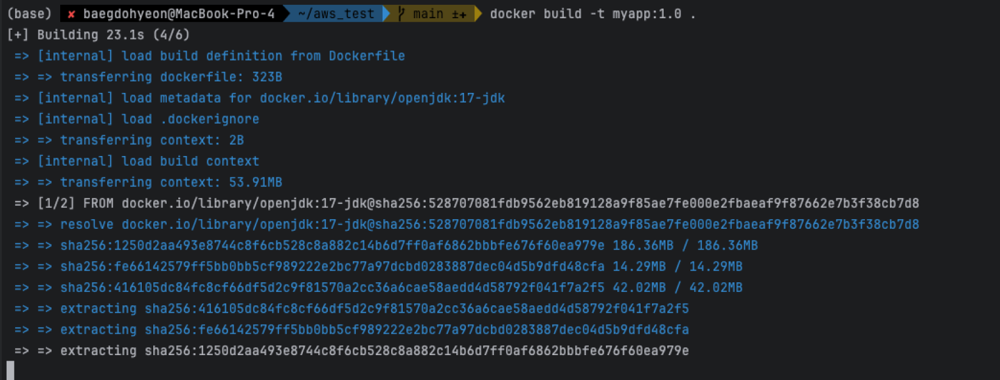

빌드 된 이미지를 docker 를 통해 실행합니다.

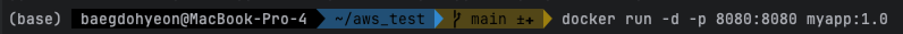

<br>  

## 1. GitHub Actions 에서 Docker 이미지를 자동으로 빌드 & 테스트  
이번 과정에서는 코드를 GitHub 에 push 하면 GitHub Actions 가 코드를 가져오고 Gradle/Maven 으로 JAR 빌드를 진행합니다.  
그리고 도커 이미지를 이미지 레지스트리인 GHCR(GitHub Container Registry)에 업로드 합니다.    

이미지 레지스트리는 GHCR 또는 ECR 을 주로 사용하는데 처음이면 GHCR 을 추천합니다. (쉽고 GitHub 계정만 있으면 간단하고 쉽게 사용가능하기 때문!)  
그래서 우선 GHCR 을 활성화 해보겠습니다.  
우선, GitHub 에서 Settings -> Developer settings -> Personal access tokens -> Tokens (classic) 을 눌러 토큰을 생성해줍시다.


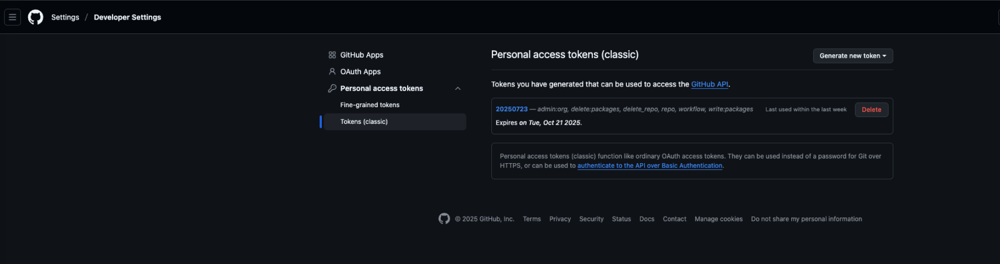

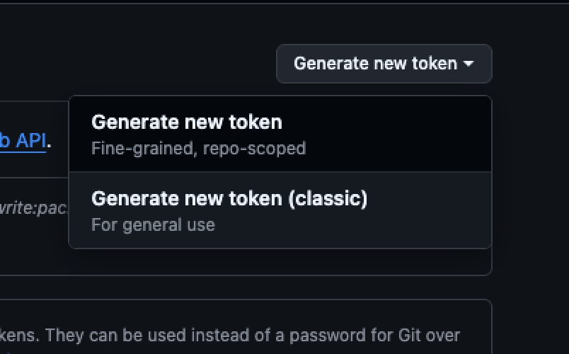  

Note 에는 해당 토큰의 이름을 넣어주면 되겠습니다.  
그리고 권한은 아래와 같이 설정합니다.  
- read: packages
- write: packages
- delete : packages (선택)

토큰을 생성 후 저장버튼을 눌러줍니다

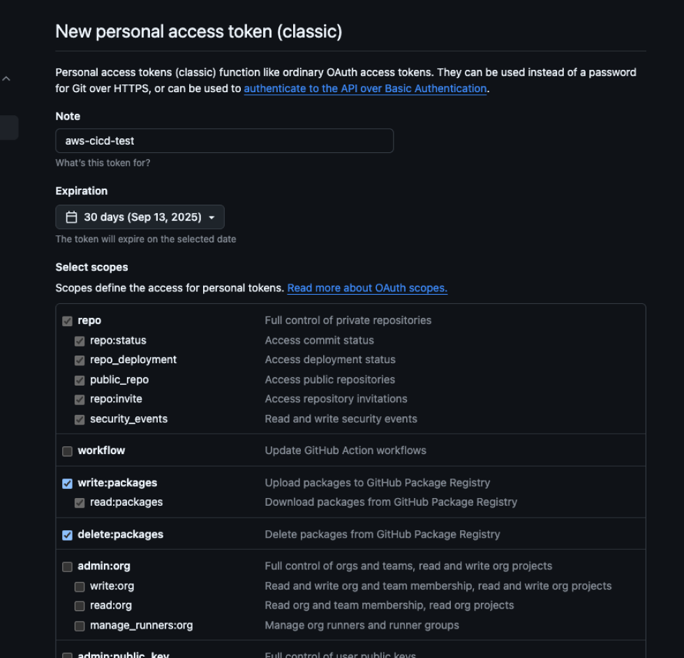  

그럼 아래와 같이 토큰 값(?) 이 처음에만 보여지는데 이 값을 잘 저장해놓으시길 바랍니다.  
(이후에는 해당 토큰 값을 확인할 수 없습니다.)

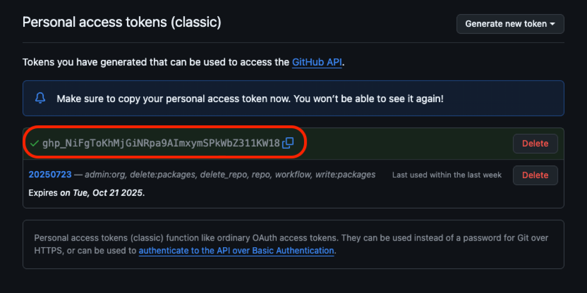

GitHub Secrets 를 등록하기 위해  
저장소 -> Settings -> Secrets and variables -> Actions -> New repository secret 을 클릭하여 줍니다.  
2개의 Secret 을 생성 해줄 텐데 아래와 같이 작성해서 추가해주시면 되겠습니다.  
- GHCR_USERNAME : GitHub 아이디
- GHCR_TOKEN : 방근 만든 토큰(Personal Access Token) 값


주의할 점은 GitHub 아이디를 넣을때는 대문자를 넣지 않고 모두 소문자로 입력해주어야 합니다.  
ex) BaekDoHyeon 이라는 GitHub 아이디를 가지고 있다면, baekdohyeon 리고 입력하고 추가 해주어야 합니다.

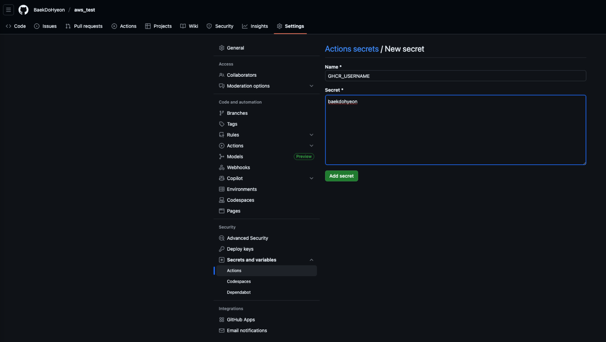

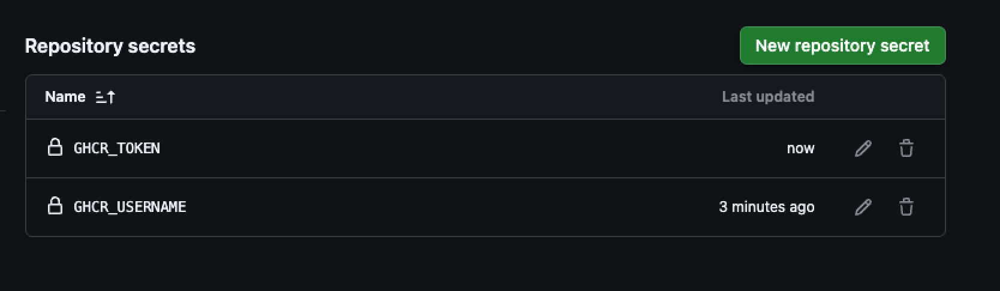

다음은 Actions 워크플로우 파일을 만들어봅시다.  
경로는 프로젝트 경로에서 .github/workflows/docker-build.yml 로 잡아줍니다.  
해당 경로가 아니라면 인식을 못하니까 주의하셔야 합니다.

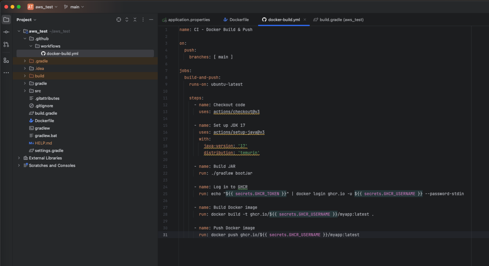

### *docker-build.yml 파일 분석*
1. 트리거
```angular2html
on:
    push:   
        branches: [ main ]


--------------------------------- 설 명 ---------------------------------
=> main 브랜치에 push 될 때마다 실행합니다.
``` 

2. 코드 체크아웃
```angular2html
- name: Checkout code
  uses: actions/checkout@v3


--------------------------------- 설 명 ---------------------------------
=> GitHub Actions Runner에 현재 리포지토리 코드 내려받기

여기서의 uses 속성은 "이미 다른 사람이 만들어 둔 Action(작업 모듈)을 가져다가 실행" 한다는 뜻입니다. 
user : 뒤에는 "누가/무엇을@버전" 형식의 값이 들어옵니다.

위 코드에서 사용되는 actions/checkout@v3 는 GitHub이 공식 제공하는 checkout 액션입니다.
이 액션의 역할은 현재 워크플로우가 실행되는 서버(빌드 서버)에, 내가 푸시한 소스 코드를 다운로드해 놓습니다.
이 액션을 사용하지 않으면 코드를 가져올 수 없고, 그러면 빌드 단계에서 아무 파일도 없어서 ./gradlew bootJar 같은 명령어를 사용할 수 없습니다.
```

3. JDK 17 설치
```angular2html
- name: Set up JDK 17
  uses: actions/setup-java@v3
  with:
    java-version: '17'
    distribution: 'temurin'


--------------------------------- 설 명 ---------------------------------
=> Gradle 빌드에 필요한 Java 환경 세팅

actions/setup-java@v3 는 빌드 서버에 JDK(Java Development Kit)를 설치하고, 사용할 버전을 세팅합니다.
```

4. Spring Boot JAR 빌드
```angular2html
- name: Build JAR
  run: ./gradlew bootJar


--------------------------------- 설 명 ---------------------------------
=> build/libs/에 실행 가능한 JAR 생성
```

5. GHCR 로그인
```angular2html
- name: Log in to GHCR
  run: echo "${{ secrets.GHCR_TOKEN }}" | docker login ghcr.io -u ${{ secrets.GHCR_USERNAME }} --password-stdin


--------------------------------- 설 명 ---------------------------------
=> 시크릿 값으로 GHCR 인증
```

6. Docker 이미지 빌드
```angular2html
- name: Build Docker image
  run: docker build -t ghcr.io/${{ secrets.GHCR_USERNAME }}/myapp:latest .


--------------------------------- 설 명 ---------------------------------
=> JAR 포함된 이미지를 태그 latest로 빌드
```

7. Docker 이미지 푸시
```angular2html
- name: Push Docker image
  run: docker push ghcr.io/${{ secrets.GHCR_USERNAME }}/myapp:latest


--------------------------------- 설 명 ---------------------------------
=> GHCR에 업로드
```


<br>

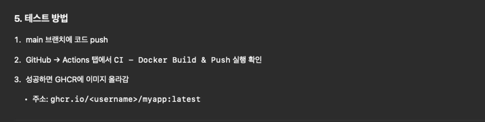

위 방법으로 테스트를 진행해봅시다.  

깃허브의 Actions 탭에서 제대로 파이프라인이 동작한 것을 알 수 있습니다.

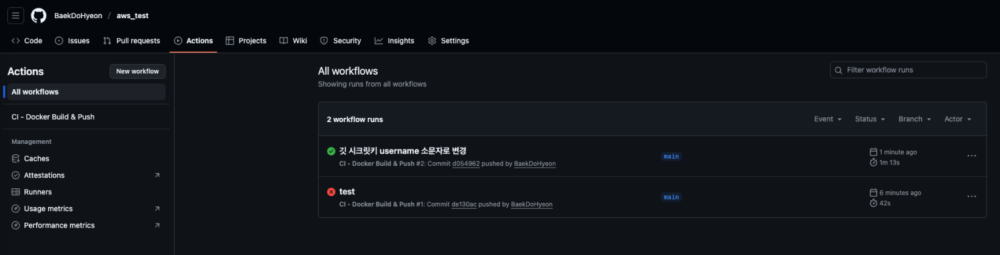

GHCR 주소로 접속하여 우리의 도커 이미지가 제대로 올라간것을 확인할 수 있습니다.

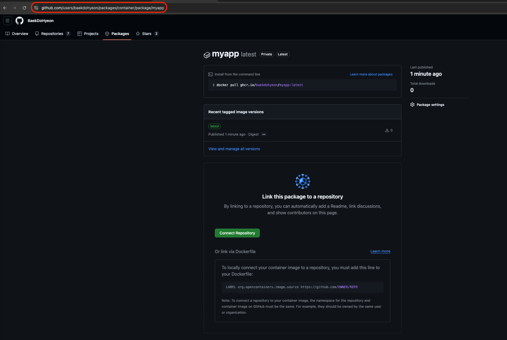

<br>  

## 2. EC2 자동 배포

이제 할 일은 EC2 에서 GHCR 에 올라간 이미지를 가져와서 실행하는 것 입니다.  
우선, EC2 에 접속하여서 docker 를 설치해줍시다.  
```
$ sudo apt update

-- 도커 설치
$ sudo apt install -y docker.io

-- 도커 실행
$ sudo systemctl start docker

-- 도커 상태 확인
$ sudo systemctl status docker
```

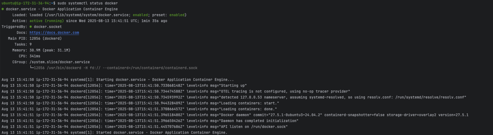

아래 사진처럼 EC2 에서 GHCR 에 접속(로그인) 이 되는지 확인해봅니다.

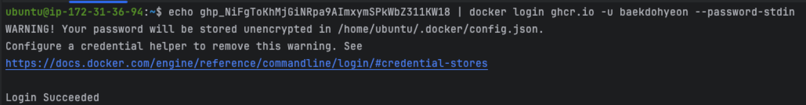

<br>

그러면 이제 우리가 docker 이미지를 GHCR 에서 가지고 오고 docker 로 실행을 시켜야 합니다.  

우선 EC2 의 접속 정보를 위해서 3개의 Secret 을 추가하여 줍시다.
- **EC2_HOST** : EC2 퍼블릭 IP 또는 도메인
- **EC2_USER** : EC2 접속 유저 (예: ubuntu)
- **EC2_SSH_KEY** : 로컬에서 쓰는 개인키 내용을 그대로 복사

이때, SSH_KEY 를 넣을때는 줄바꿈 포함 전체 내용을 복사해야합니다.   
----BEGIN--- .... ----END---- 까지 전부 복사하여 붙여넣기!  
(AWS key.pem 파일 내용을 의미합니다.)

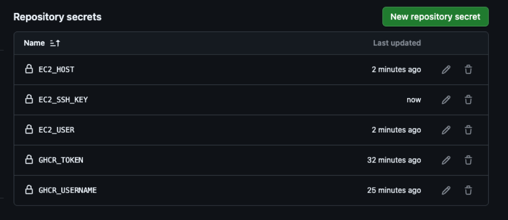

그전에 우리가 도커로 스프링을 실행을 할 때 DB 접속 정보를 알아야 하겠죠?  
아래와 같이 application.properties 설정파일에 DB 접속 정보를 입력하지만, 중요한 정보가 배포되게 되어 공개되면 매우 곤란한 상황에 처할 수 있습니다.  
그렇기 때문에 DB 관련 정보는 GitHub Secret 으로 추가하여 관리하여 줍니다!

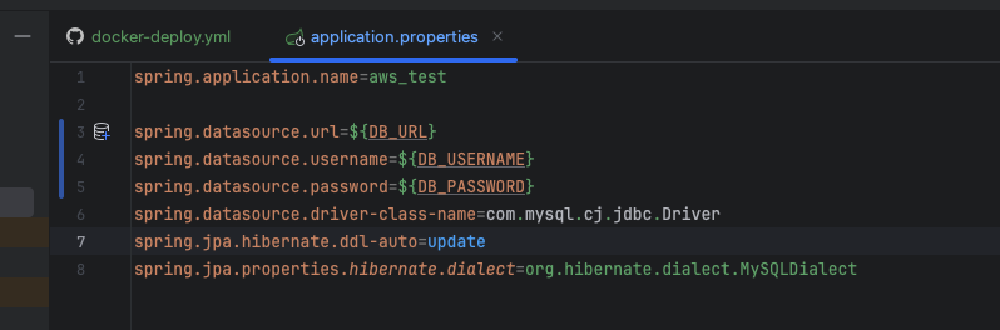

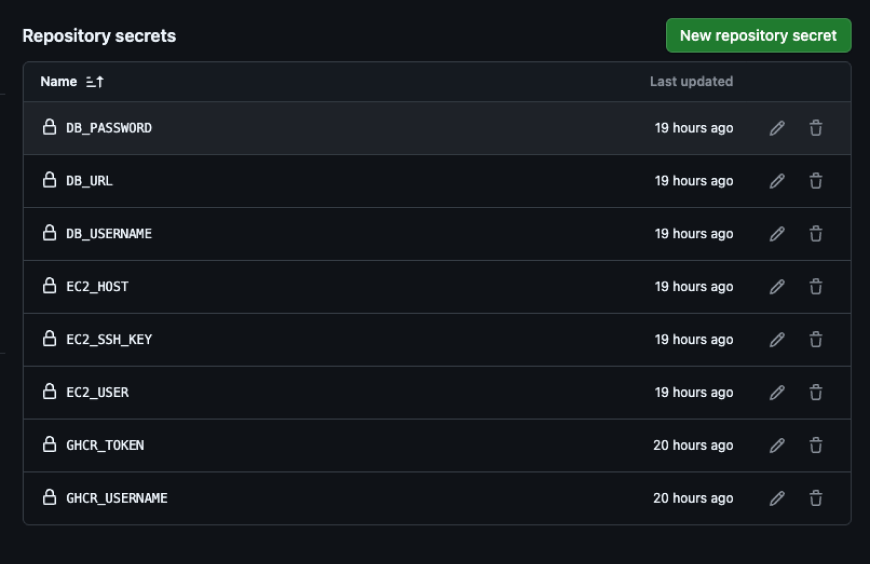

위에서 빌드 자동화 스크립트 파일을 만든 경로와 동일한 경로에 아래와 같은 자동화 스크립트 파일을 하나 만들어줍니다.

이 파일은 CI 과정에서 빌드/푸시된 Docker 이미지를 EC2 서버에 배포하고 실행하는 자동화 스크립트입니다.  
즉, EC2 에서 기존 컨테이너를 중지/삭제하고 새 이미지를 받아 실행한 뒤, 정상 구동 여부를 Health Check로 검증하는 역할을 합니다. 

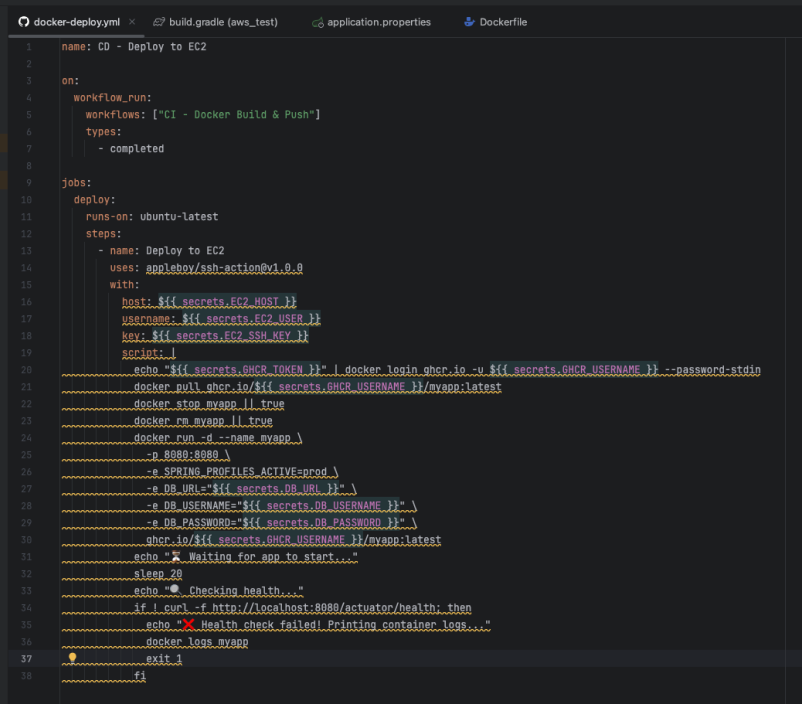  

### *docker-deploy.yml 파일 분석*

1. 트리거
```angular2html
on:
  workflow_run:
    workflows: ["CI - Docker Build & Push"]
    types:
      - completed


--------------------------------- 설 명 ---------------------------------
=> 빌드&푸시 워크플로우가 완료되면 자동 실행
```

2. EC2 원격 접속
```angular2html
uses: appleboy/ssh-action@v1.0.0
with:
  host: ${{ secrets.EC2_HOST }}
  username: ${{ secrets.EC2_USER }}
  key: ${{ secrets.EC2_SSH_KEY }}


--------------------------------- 설 명 ---------------------------------
=>  SSH 키로 EC2 로그인
```

3. 배포 스크립트 실행
```angular2html
echo "${{ secrets.GHCR_TOKEN }}" | docker login ghcr.io -u ${{ secrets.GHCR_USERNAME }} --password-stdin
docker pull ghcr.io/${{ secrets.GHCR_USERNAME }}/myapp:latest
docker stop myapp || true
docker rm myapp || true
docker run -d --name myapp \
  -p 8080:8080 \
  -e SPRING_PROFILES_ACTIVE=prod \
  -e DB_URL="${{ secrets.DB_URL }}" \
  -e DB_USERNAME="${{ secrets.DB_USERNAME }}" \
  -e DB_PASSWORD="${{ secrets.DB_PASSWORD }}" \
  ghcr.io/${{ secrets.GHCR_USERNAME }}/myapp:latest


--------------------------------- 설 명 ---------------------------------
=> GHCR 로그인을 하여 최신 이미지를 Pull 받습니다.  
기존 컨테이너를 중지하고 삭제한 후 새로운 컨테이너를 실행합니다.
이때 환경변수로 DB 접속 정보를 전달해줍니다.
```

4. 헬스(health) 체크
```angular2html
echo "⏳ Waiting for app to start..."
sleep 20
echo "🔍 Checking health..."
if ! curl -f http://localhost:8080/actuator/health; then
  echo "❌ Health check failed! Printing container logs..."
  docker logs myapp
  exit 1
fi


--------------------------------- 설 명 ---------------------------------
=> 앱 기동 대기 20초 후에 /actuator/health 호출
실패 시 로그 출력 후 종료
```


<br>  


해당 파일을 작성하고 main 에 push 할 경우 아래와 같이 워크플로우가 동작하게 됩니다.  
아래 사진은 해당 CI/CD 파이프라인이 정상적으로 동작한다는 것을 확인할 수 있습니다.

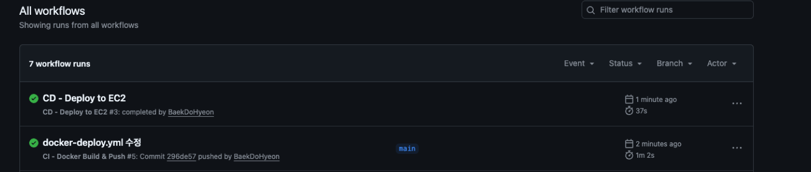

*!! health 체크를 하기 위해서는 아래와 의존성을 추가해주어야 합니다. + yml 파일에 한줄 추가 !!*
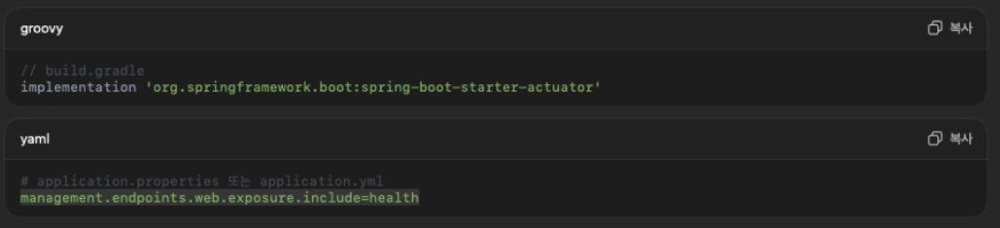


