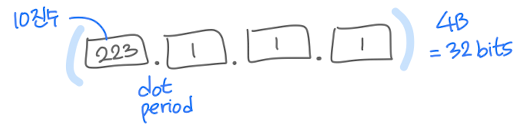
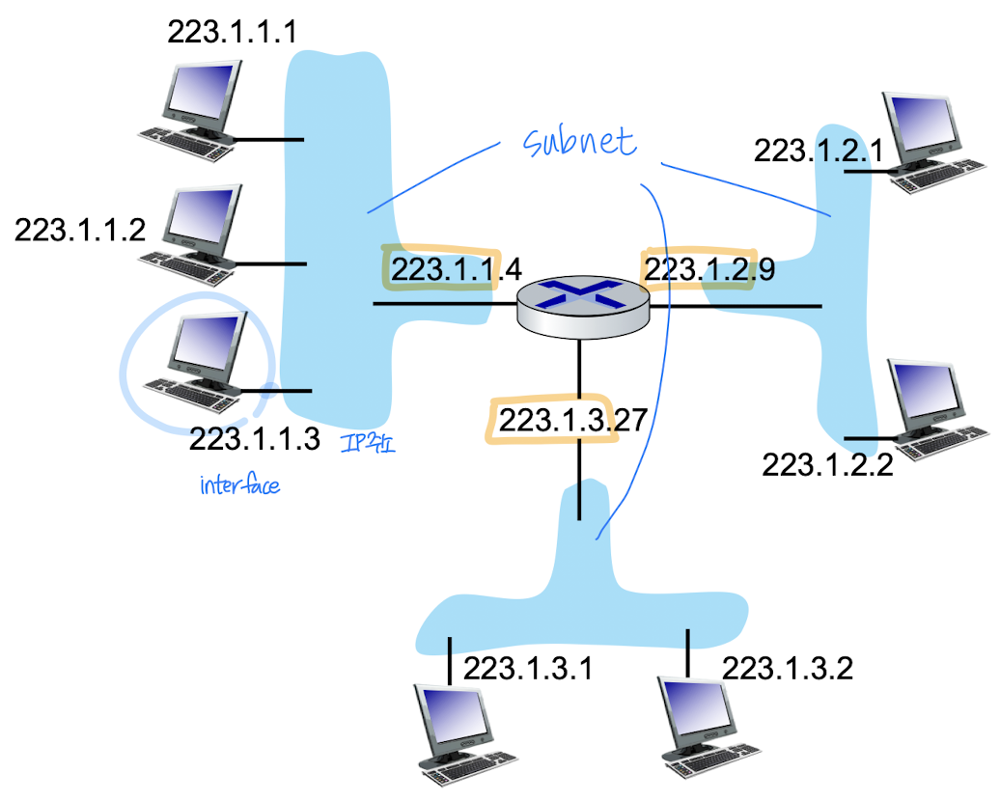
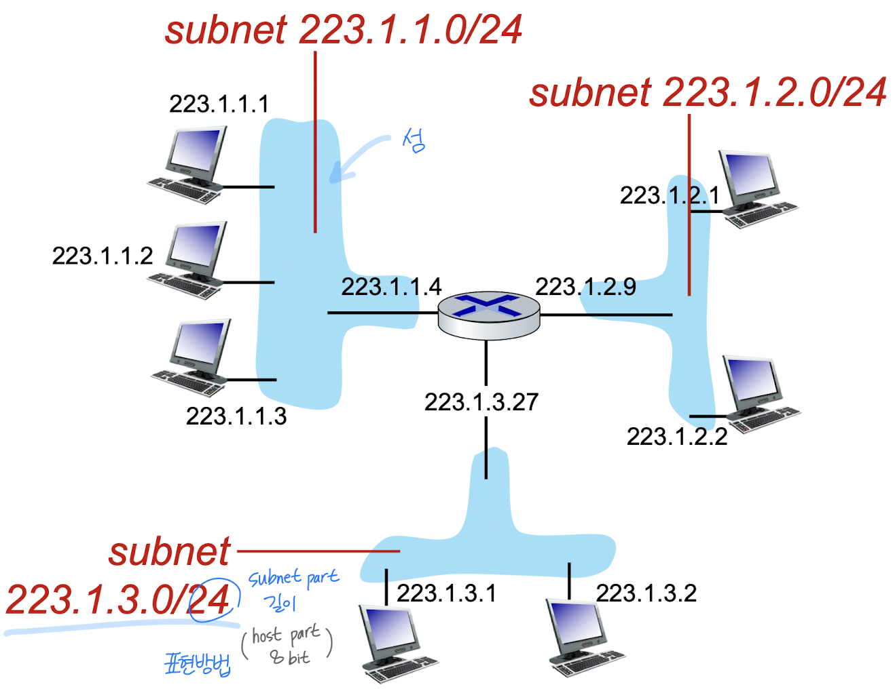
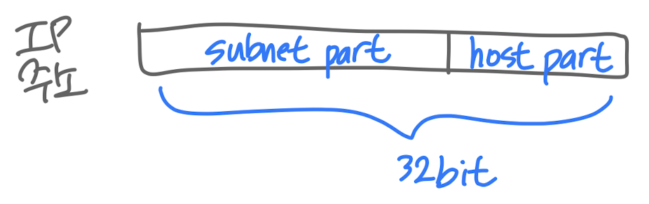

## IP addressing

### IP addr

- **32-bit** identifier associated with host / router interface
- dotted-decimal notation

### interface

- **connection**
- **NIC** : Network Interface Card
- router : multiple interfaces
- host : one or two interfaces

## Subnets

- islands of isolated networks
- interfaces, **physically** reach each other, with**out** passing router
- IP addr structure
  - `subnet` part : 네트워크 이름, high order bits(MSB부터 시작)
  - `host` part : 네트워크 내의 호스트 이름, remaining low order bits

## CIDR

- **C**lassless **I**nter**D**omain **R**outing
- subnet in **arbitary** length
- format: `a.b.c.d/x`
  - x: # bits of subnet, 8의 배수 아니어도됨