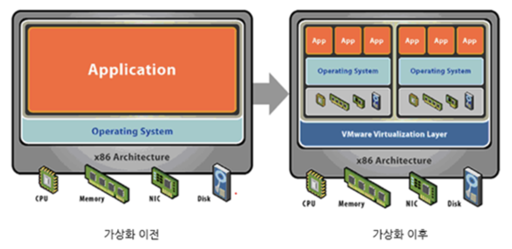
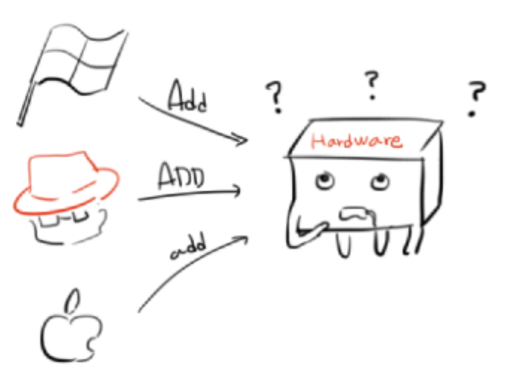
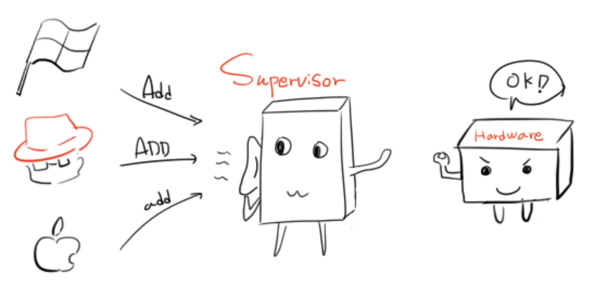
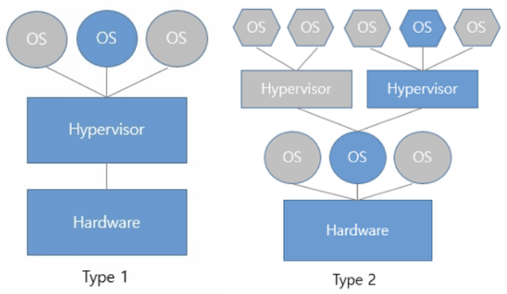

## 가상화

- 가상 하드웨어를 **simulate**(모방)하기 위해 소프트웨어 사용
  - 하나의 기계에서 여러개의 VM(가상머신) 돌릴 수 있음
  - 돌리는 기계 - host / 돌려지는 VM - guest
- 하나의 물리머신 상에서 복수 시스템 동시운영
- 또다른 cpu, 메모리, 하드디스크 논리적으로 생성
- 애플리케이션 단위로 전환

## 가상머신

- 컴퓨터 머신을 **소프트웨어**로 구현한 것
- 실제 컴퓨터의 독립적인 복제본
- 가상화 기술로 만들 수 있음

## 가상머신 사용하는 이유

- VDI (회사에서)
  - virtual desktop infrastructure
  - 원격으로 데스크톱 환경에 접근 가능
  - 디지털 사무실
- 보안성 good
  - 호스트 OS로부터 분리됨
  - 테스트하기 좋은 환경
- 클라우드 컴퓨팅
- 가성비 good
  - 한 서버에 여러 VM 호스팅
  - 한 서버당 각 어플리케이션에 VM
- 확장성
  - VM을 추가하는건 물리적인 머신에 존재하는 VM을 클론하는 것과 같음
  - 물리적인 서버에 각각 다른 OS 설치하는거보다 훨씬 빠르고 효율적

## 서로 다른 OS를 사용할 수 있는 이유

- 각 OS마다 **커널** 존재
  - 커널: 리소스 관리, 명령어 해석
- OS마다 명령어 해석 규칙 다름 !!

### **하이퍼바이저**

- VM과 하드웨어간의 IO명령을 처리하는 인터페이스
  - 각 OS 명령 → 하나의 명령어로 번역
  - 반대로 각 OS에게 하드웨어의 리소스들을 나눠주면서 조율

