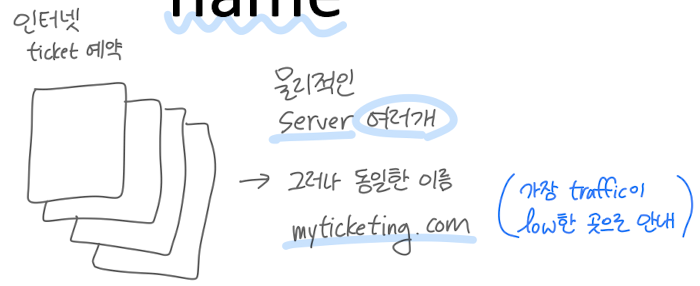

## DNS

### Domain Name System

- domain name → IP주소
- Internet hosts, routers identifiers
  - `IP address` (32 bit)
    - addressing datagrams
    - ex) 201.178.34.95
  - `name`
    - ex) www.google.co.kr
    
- **Domain Name System (DNS)**
  - `distributed` database
    - hierarchy of many name db servers
  - `application`-layer protocol
    - **resolve** names (host, DNSserver)
    - address/name translation
    - **core** Internet function

### DNS services

- `translation` : hostname → IP addr
- `host` aliasing : canonical & alias

- `mail server` aliasing

- load `distribution` : many IP addrs → one name


### Why **not** centralize DNS?

- **single point of failure** : 단일실패점
- **too many traffic**
- **distant** : 거리 먼 경우
- **maintenance** : 유지보수하는 동안 서버에 차질

### Thinking about the DNS

- **humongous** distributed database
- handles many of queries a day
  - **reads** > writes
  - **performance** matters
- organizationally, physically **decentralized**
    - 계층구조, query가 여러 지역으로 분산됨
- bulletproof : reliability, **security**

```md
“ DNS 쉽지 않다 ! "
```


## Distributed, Hierarchical Database


- `트리` 형태 : `Root` - `TLD` - `authoritative`
- 모든 질문에 대한
  - 답을 **알거나**
  - 답을 **아는 사람**이 있음

```md
1. root server : find .com DNS server
2. .com DNS server : get amazon.com DNS server
3. amazon.com DNS server : IP addr for www.amazon.com
```

### Root name servers


- 전세계적으로 `13`개 + mirror본 (우리나라에도 있음)
- official, `contact-of-last-resort`
  - 답을 알만한 사람을 최소 1개 이상 앎
- incredibly important
  - `DNSSEC` : provides security
  - authentication, message integrity
- `ICANN`
  - Internet Corporation for Assigned Names and Numbers (국제기구)
  - manages **root** DNS domain
  - IP주소를 각 지역별로 할당
- **ccTLD** : country code Top Level Domain

### TLD and Authoritative servers


- **Top-Level Domain (**`TLD`**)** servers
  - top-level country domains : .uk, .fr, .kr
  - authoritative registry for .com, .net TLD
  - educause : .edu TLD
- `authoritative` DNS servers
  - **organization**’s own DNS servers


## Local DNS name servers

- host makes DNS query → sent to its **local DNS server**
    - 가장 먼저 보내짐
    - local DNS server reply from its local **cache**
    - cache에 답이 있으면 바로 보내줌
    - find my local DNS name server : `% scutil --dns`
- does**n’t** strictly belong to hierarchy


## DNS name resolution

### Iterated query


- contacted server replies with name of server to contact
- “I don’t know, ask this server”
- local DNS server에 **부담 up**
- 답을 알면 바로 응답
- root로 가는 traffic ↓

### Recursive query


- puts **burden** on contacted **name server**
- heavy load at upper levels of hierarchy
- 나머지 DNS server들에 부담 ↑
- local DNS server **부담 down** : 질문을 한번 하면 답이 올 때까지 **기다림**


## Caching DNS Information

- `caches` mapping
  - domain name, IP주소 (**table** 형태로)
  - 항상 최신 정보 보장x (유효기간 존재)
- `immediately` returns a cached mapping
- improves response time
- `TTL` : Time To Live (Expire), **timeout** after some time
- TLD servers cashed in **local** name servers : 그래야 질문할 수 있음
- may be **out-of-date**
  - domain name은 그대로, IP주소가 바뀌는 경우
  - 그러나 유효기간에 대한 방침이 회사마다 다를 수 있음 (칼같이 지키거나 / 방치하거나)
  - `best-effort` name-to-address translation : 항상 최신은 아님


## DNS records

- **RR** : resource records


- `name`
- `value`
- `type` : 어떤 종류인지
- `ttl` : 유효기간 (sec)

### type=A

- `name` : **hostname**
- `value` : **IP addr**

### type=NS

: Name Server

- `name` : **domain**
- `value` : **hostname** of
**authoritative** name server
- 규모가 작은 회사는 하나의 server가 전부 담당

### type=CNAME

- `name` : **alias** name
- `value` : **canonical** name

### type=MX

- `name` : **alias** name of mail server
- `value` : **domain name** of mail server
  - ex) john@foo.com → mail3.foo.com (**NS**가 알려줌)


## DNS security

### DDos attacks

- bombard **root** servers with traffic
  - **not** successful
  - root는 보안이 철저함
  - root로 실제 가는 traffic이 많지x (cache IPs)
- bombard **TLD** servers
  - potentially more dangerous

### Spoofing attacks


- 더 위험
- **intercept** DNS queries
- return bogus replies : 자기가 마치 server인 것처럼
- DNS cache poinsoning : cache 내용 조작 (심각)
- **DNSSEC** (DNS Security) : 새로운 인터넷 표준, 성능은 그닥